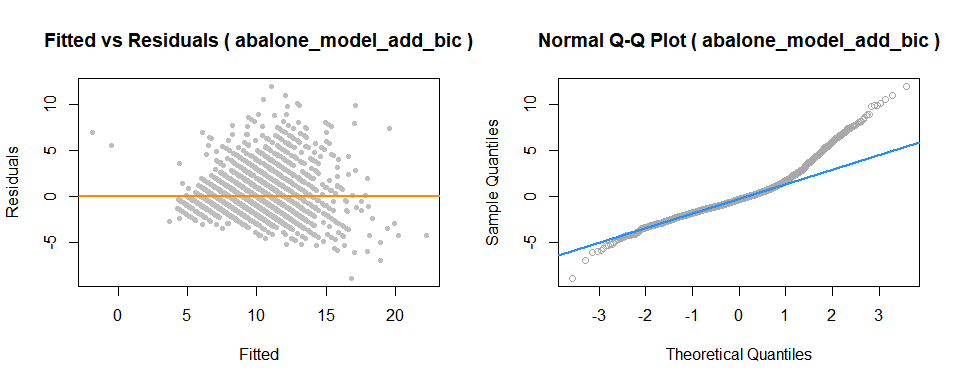
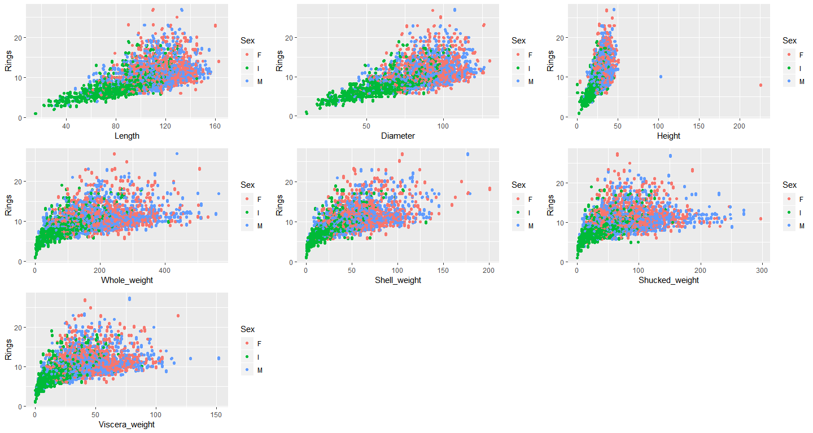
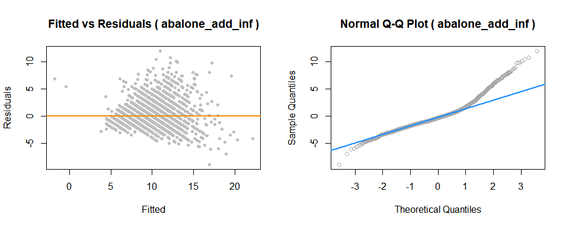
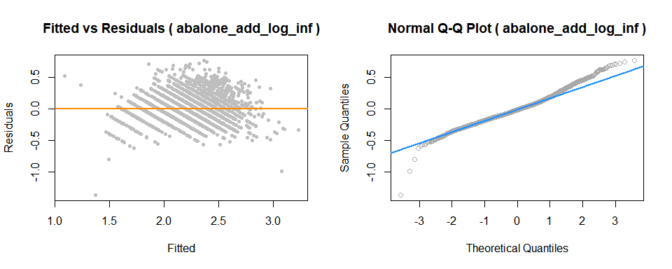
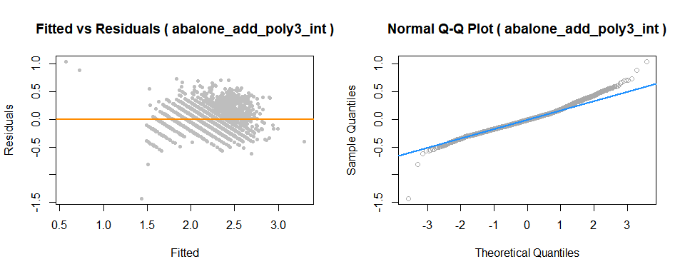
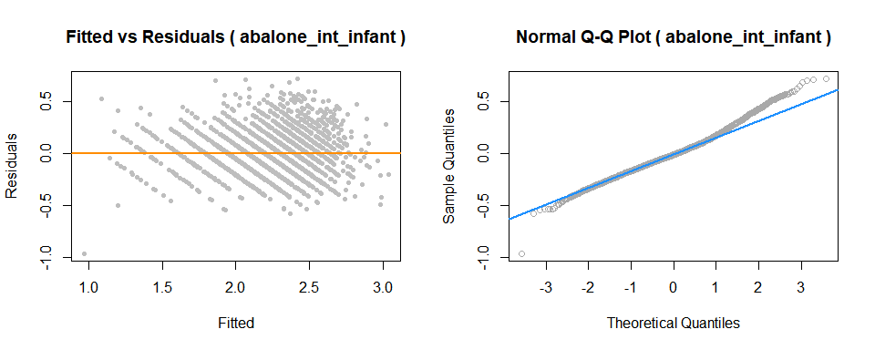
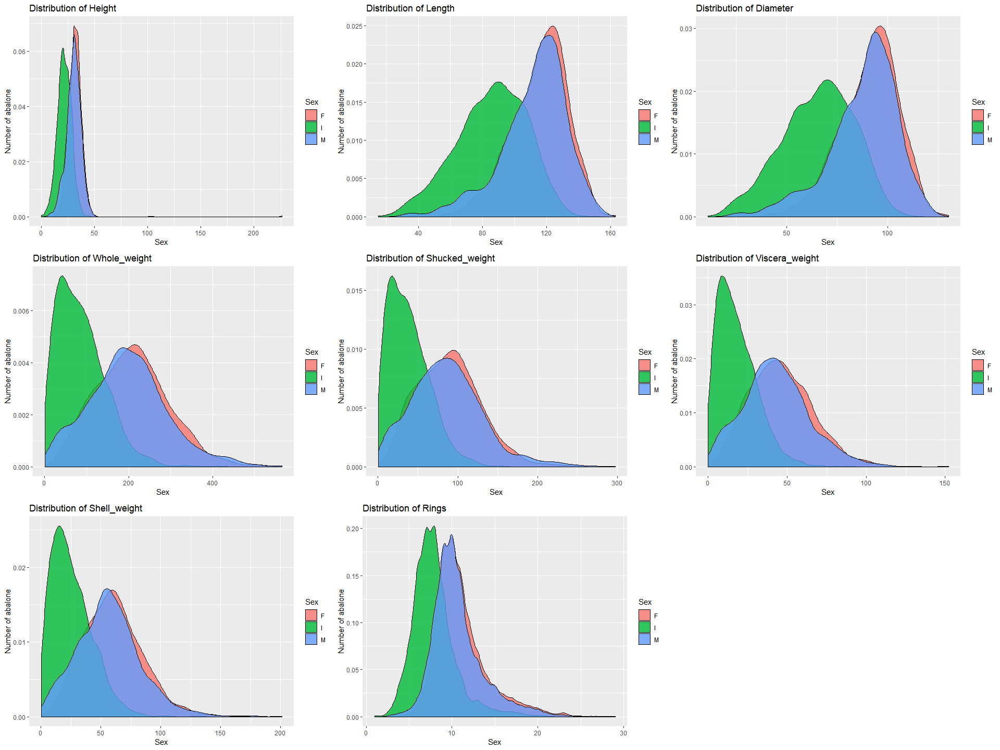

# predicting-age-of-abalone-using-regression

## Introduction
  - Abalone is a shellfish considered a delicacy in many parts of the world. An excellent source of iron and pantothenic acid, and a nutritious food resource and farming in Australia, America and East Asia. 100 grams of abalone yields more than 20% recommended daily intake of these nutrients. The economic value of abalone is positively correlated with its age. Therefore, to detect the age of abalone accurately is important for both farmers and customers to determine its price. However, the current technology to decide the age is quite costly and inefficient. Farmers usually cut the shells and count the rings through microscopes to estimate the abalones age. Telling the age of abalone is therefore difficult mainly because their size depends not only on their age, but on the availability of food as well. Moreover, abalone sometimes form the so-called 'stunted' populations which have their growth characteristics very different from other abalone populations This complex method increases the cost and limits its popularity. Our goal in this report is to find out the best indicators to forecast the rings, then the age of abalones.
  
### Dataset
#### Background
 - This dataset comes from an original (non-machine-learning) study and received in December 1995:
    - Warwick J Nash, Tracy L Sellers, Simon R Talbot, Andrew J Cawthorn and Wes B Ford (1994)
    - "The Population Biology of Abalone (_Haliotis_ species) in Tasmania. I. Blacklip Abalone (_H. rubra_) from the            North Coast and Islands of Bass Strait",
    - Sea Fisheries Division, Technical Report No. 48 (ISSN 1034-3288).
    - Dataset can be found on [UIC Machine learning repository site](https://archive.ics.uci.edu/ml/datasets/Abalone)
    - **Citation:**
        - There are more than 30 papers that cites this data set. Please find the full list at [UIC Machine learning repository site](https://archive.ics.uci.edu/ml/datasets/Abalone) 
 
#### Description
 - From the original data examples with missing values were removed (the majority having the predicted value missing),    and the ranges of the continuous values have been scaled for use with an ANN (by dividing by 200). For the purpose    of this analysis, we will scale those variables back to its original form by multiplying by 200.
 
 - Total number of observations in dataset: **4176**
 - Total number of variables in dataset : **8**
 
 - Metadata and attribute information:
    - Given is the attribute name, attribute type, the measurement unit and a brief description.  The number of rings is      the value to predict as a continuous value.
   
#### Variable List
   | Name   |      Data Type      |  Measurement | Description |
   |----------|:-------------|:------| :-----------|
   | Sex |  categorical (factor) |  |  M, F, and I (Infant)  |
   | Length |  continuous	 | mm |  Longest shell measurement  |
   | Diameter |  continuous	 | mm | perpendicular to length  |
   | Height |  continuous	 | mm |  with meat in shell  |
   | Whole weight |  continuous	 | grams	 |  whole abalone  |
   | Shucked weight |  continuous	 | grams	 |  weight of meat  |
   | Viscera weight	 |  continuous	 | grams	 |  gut weight (after bleeding)  |
   | Shell weight |  continuous	 | grams	 |  after being dried  |
   | Rings |  continuous	 |  | +1.5 gives the age in years  |

#### Interest

- **Predicting the age of abalone from physical measurements:**  
    - The age of abalone is determined by cutting the shell       through the cone, staining it, and counting the number of rings through a microscope -- a boring and
      time-consuming task.  Other measurements, which are easier to obtain, are used to predict the age.  Further           information, such as weather patterns and location (hence food availability) may be required to solve the             problem.
- **Apply different regression techniques:**
    - We are interested in performing various regression techniques such as additive models, interactions, polynomial transformations of the variables etc to be able to predict and assess the accuracy of our prediction.
- **Beyond regression models:**
    - Is there any other type of machine learning methodology which can predict the age more accurately than using regression model ?

- **Implementation in real application:**
    - Understand whether the data set & the regression models are sufficient to predict the age of abalone accurately enough so that it can be used in real application. 


Below is the analysis


---
"Predicting the age of abalone using regression"
--


## Methods

```r
#Run these commands to intall all the required packages for this reportt
install.packages("readr")
install.packages("dplyr")
install.packages("car")
install.packages("lmtest")
install.packages("ggplot2")
install.packages("GGally")
install.packages("gridExtra")
install.packages("MASS")
install.packages("leaps")
install.packages("glmnet")
install.packages("caret")
install.packages("gbm")
```


```r
#loading all necessary packages 
library(readr)
library(dplyr)
library(car)
library(lmtest)
library(ggplot2)
library(GGally)
library(gridExtra)
library(MASS)
library(leaps)
library(glmnet)
library(caret)
library(gbm)
```

### Data summary and statistics

```r
abalone <- read_csv("Abalone_data.csv")

is.factor(abalone$Sex)
```

```
## [1] FALSE
```

```r
abalone$Sex <- as.factor(abalone$Sex)
str(abalone, give.attr = FALSE)
```

```
## Classes 'tbl_df', 'tbl' and 'data.frame':	4176 obs. of  9 variables:
##  $ Sex           : Factor w/ 3 levels "F","I","M": 3 1 3 2 2 1 1 3 1 1 ...
##  $ Length        : int  70 106 88 66 85 106 109 95 110 105 ...
##  $ Diameter      : int  53 84 73 51 60 83 85 74 88 76 ...
##  $ Height        : int  18 27 25 16 19 30 25 25 30 28 ...
##  $ Whole_weight  : num  45.1 135.4 103.2 41 70.3 ...
##  $ Shucked_weight: num  19.9 51.3 43.1 17.9 28.2 47.4 58.8 43.3 62.9 38.8 ...
##  $ Viscera_weight: num  9.7 28.3 22.8 7.9 15.5 28.3 29.9 22.5 30.2 29.5 ...
##  $ Shell_weight  : num  14 42 31 11 24 66 52 33 64 42 ...
##  $ Rings         : int  7 9 10 7 8 20 16 9 19 14 ...
```

```r
library(knitr)
kable(abalone[1:10,], digits = 4,format = 'markdown')
```


|Sex | Length| Diameter| Height| Whole_weight| Shucked_weight| Viscera_weight| Shell_weight| Rings|
|:---|------:|--------:|------:|------------:|--------------:|--------------:|------------:|-----:|
|M   |     70|       53|     18|         45.1|           19.9|            9.7|           14|     7|
|F   |    106|       84|     27|        135.4|           51.3|           28.3|           42|     9|
|M   |     88|       73|     25|        103.2|           43.1|           22.8|           31|    10|
|I   |     66|       51|     16|         41.0|           17.9|            7.9|           11|     7|
|I   |     85|       60|     19|         70.3|           28.2|           15.5|           24|     8|
|F   |    106|       83|     30|        155.5|           47.4|           28.3|           66|    20|
|F   |    109|       85|     25|        153.6|           58.8|           29.9|           52|    16|
|M   |     95|       74|     25|        101.9|           43.3|           22.5|           33|     9|
|F   |    110|       88|     30|        178.9|           62.9|           30.2|           64|    19|
|F   |    105|       76|     28|        121.3|           38.8|           29.5|           42|    14|

##### Categorial Variables

| Sex | Number of observations |
| --- | ---------------------- |
|  M  | 1527 |
|  F  | 1307 |
|  I  | 1342 |

##### Numeric Variables

|      | Length | Diameter | Height | Whole Weight | Shucked Weight  | Viscera Weight | Shell Weight | Rings |
| ---- | ------ | -------- | ------ | ----- | ------- | ------- | ----- | ----- |
| Min  | 15.0   | 11.00    | 0.0000 | 0.4   | 0.20    | 0.10    | 0.30  | 1     |
|Median| 109.0  | 85.00    | 28.00  | 159.9 | 67.20   | 34.20   | 46.80 | 9     |
| Mean | 104.8  | 81.58    | 27.91  | 165.8 | 71.88   | 36.12   | 47.77 | 9.932 |
| Max  | 163.0  | 130.00   | 226.00 | 565.1 | 297.60  | 152.00  | 201.00| 29    |
| Cor  | 0.557  | 0.5750   | 0.5581 | 0.5408| 0.4212  | 0.5043  | 0.6280| 1.000 | 
 
 - Looking at the dataset summary, we can see that data is quite evenly distributed between the three factor levels of `male`, `female` and `infant`. 
 
 - Also from we see that there are four different measure of weight i.e. `Whole_weight`, `Shucked_weight`, `Viscera_weight` and `Shell.weight`. `Whole_weight` is linear function of other weight predictors with Unknown mass of water/blood lost from shucking process. Also we observed that min value of predictor `Height` is 0. Practically this is not possible, we will investigate these observations to look closely.
 
##### Response variable

- The dependent variable Rings is included in the dataset. It was measured as the number of rings observed after cutting and examining an abalone. Although it does not denote the age of a given abalone directly, it determines it more-or-less perfectly. The age of an abalone equals Rings + 1.5 . Since this relationship holds reliably, Rings will be considered as the dependent variable. The number of rings measured in the data ranges from 1 to 29 and most of the abalone have between 5 and 15 rings. The distribution is slightly positively skewed as well but this does not pose any specific problems for the further analysis. (see plot below)

####Pair Plot


```r
ggpairs(abalone, aes(colour = Sex, alpha = 0.8), title="Pairs plot for abalone dataset") + 
  theme_grey(base_size = 8)
```

<!-- -->

####Observations from Pair Plot :

- First thing to note here is high correlation in data. There seems to be high multicollinearity between the predictors. for example correlation between `Diameter` and `Length` is extremely high (about 98.7).

- Similarly `Whole_weight` seems to be highly correlated with other weight predictors and is the sum of `Shucked_weight`, `Viscera_weight` and `Shell_weight`.

- Secondly, the distributions of predictor `Sex` with factor level value of `female` and `male` are very similar with respect to all other predictors.

- The shape of distribution is also significantly similar for factor levels of `female` and `male`.

- We could think about redefining this feature to define gender as infant vs non-infant (where non-infant = female and male both).

- Most of the abalones rings are between 5 and 15.


#### Data quality 
- **Addition of variables**: We will update the abalone dataset to create new variable named `Infant` which will have values based on original value from `Sex` variable. It will have value of `I`, when `Sex` variable is `I` and `NI` otherwise.


```r
abalone['Infant'] <- ifelse(abalone$Sex == 'I','I','NI')
abalone$Infant <- as.factor(abalone$Infant)
abalone$Sex <- as.factor(abalone$Sex)
```

 - Also we observed that min value of predictor `Height` is 0. Practically this is not possible, we will investigate these observations to look closely.


```r
#Data quality check for height being 0
kable(abalone[abalone$Height == 0,], digits = 4,format = 'markdown')
```


|Sex | Length| Diameter| Height| Whole_weight| Shucked_weight| Viscera_weight| Shell_weight| Rings|Infant |
|:---|------:|--------:|------:|------------:|--------------:|--------------:|------------:|-----:|:------|
|I   |     86|       68|      0|         85.6|           41.3|           17.2|         23.0|     8|I      |
|I   |     63|       46|      0|         26.8|           11.5|            5.7|         70.1|     6|I      |

- We see that there are two observations for which `Height` might not be recorded properly as other predictors seems to have valid values. Also if we look at the predictor `Whole_weight`, we see that these values are really small compare to rest of the observation and below first quantile. This tells us that this might not be a data error therefore we can  not exclude these from our dataset.

- We will also add a new variable named `weight.diff`.We can see in the summary that there are four different measure of weight i.e. `Whole_weight`, `Shucked_weight`, `Viscera_weight` and `Shell.weight`. `Whole_weight` is linear function of other weight predictors with unknown mass of water/blood lost from shucking process. 


```r
abalone$weight.diff <- abalone$Whole_weight - (abalone$Viscera_weight + abalone$Shucked_weight + abalone$Shell_weight)
str(abalone, give.attr = FALSE)
```

```
## Classes 'tbl_df', 'tbl' and 'data.frame':	4176 obs. of  11 variables:
##  $ Sex           : Factor w/ 3 levels "F","I","M": 3 1 3 2 2 1 1 3 1 1 ...
##  $ Length        : int  70 106 88 66 85 106 109 95 110 105 ...
##  $ Diameter      : int  53 84 73 51 60 83 85 74 88 76 ...
##  $ Height        : int  18 27 25 16 19 30 25 25 30 28 ...
##  $ Whole_weight  : num  45.1 135.4 103.2 41 70.3 ...
##  $ Shucked_weight: num  19.9 51.3 43.1 17.9 28.2 47.4 58.8 43.3 62.9 38.8 ...
##  $ Viscera_weight: num  9.7 28.3 22.8 7.9 15.5 28.3 29.9 22.5 30.2 29.5 ...
##  $ Shell_weight  : num  14 42 31 11 24 66 52 33 64 42 ...
##  $ Rings         : int  7 9 10 7 8 20 16 9 19 14 ...
##  $ Infant        : Factor w/ 2 levels "I","NI": 2 2 2 1 1 2 2 2 2 2 ...
##  $ weight.diff   : num  1.5 13.8 6.3 4.2 2.6 ...
```

- We see that variable `Whole_weight` should be the linear function of variables `Shucked_weight`, `Viscersa_weight` and `Shell_weight`, and we could write it as `Whole_weight` = `Shucked_weight` + `Viscera_weight`+ `Shell_weight` + unknown mass of water/blood lost from shucking process.

- However when we calculated difference between `Whole_weight` and other weight variables we see that there are 153 observations that are violating this. i.e. this seems to be a illogical and could be an error while recording data. 

- If we plot the histogram of the newly added `weight.diff` variable, we can see that there are observations when `weight.diff` is negative.


```r
#Identify observations that are not recorded properly
#Histogram of illogical observations
ggplot(abalone, aes(x=weight.diff)) +
 geom_histogram(colour="dodgerblue",fill=rgb(1,.54,0,.7), bins = 30) +
 scale_y_continuous(name="count") + 
  labs(title="Histogram of abalone with weight difference less than zero")
```

<!-- -->

- To make sure, lets take a look at few of these records.


```r
nrow(abalone[abalone$weight.diff < 0,])
```

```
## [1] 153
```

```r
kable(head(abalone[abalone$weight.diff < 0,], n=10), digits = 4,format = 'markdown')
```


|Sex | Length| Diameter| Height| Whole_weight| Shucked_weight| Viscera_weight| Shell_weight| Rings|Infant | weight.diff|
|:---|------:|--------:|------:|------------:|--------------:|--------------:|------------:|-----:|:------|-----------:|
|I   |     48|       35|      9|         14.0|            6.3|            4.7|          4.0|     5|I      |        -1.0|
|I   |     41|       30|     11|          8.4|            5.1|            3.0|          2.4|     5|I      |        -2.1|
|I   |     42|       30|     10|          8.4|            3.5|            2.5|          3.0|     4|I      |        -0.6|
|I   |     78|       59|     19|         40.6|           17.5|            9.0|         15.0|     7|I      |        -0.9|
|M   |     94|       74|     24|        115.9|           58.6|           45.4|         28.0|     9|NI     |       -16.1|
|M   |     90|       69|     21|         82.3|           36.0|           22.5|         27.0|     7|NI     |        -3.2|
|M   |    101|       81|     22|        125.0|           61.0|           32.0|         35.0|     9|NI     |        -3.0|
|F   |     87|       79|     21|         72.7|           27.2|           19.6|         26.0|     9|NI     |        -0.1|
|M   |     93|       72|     21|         86.2|           34.4|           21.4|         35.0|     9|NI     |        -4.6|
|I   |     72|       56|     16|         35.1|           16.2|           10.1|         14.0|     6|I      |        -5.2|

- Note that there are total 153 observations that has combined weight of more than `Whole_weight`. When we looked at 10 such observations, it seems that other values are correct and there is no similarity so we are sure that this might be an data entry error. Therefore we will keep these observations for further analysis.

- We will start with diving our dataset in train and test. The dataset will be splitted between train and test with the ratio of 70/30 with random selected observations.

####Train & Test Split

```r
set.seed(42)
#Splitting dataset in train and test using 70/30 method
indexes <- sample(1:nrow(abalone), size = 0.3 * nrow(abalone))
abalone_train <- abalone[-indexes,]
abalone_test <- abalone[indexes,]
```

###Additive Multiple Linear Regression Model

- We have started with fitting an additive model with all variables and will look at the significance of the parameters. Based on that we will modify our model. For now we will work with original value for variable `Sex` which have factor levels of `F`, `I` and `M`.


```r
abalone_add <- lm(Rings ~ Sex+Length+Diameter+Height+ Whole_weight
               +Shucked_weight+Viscera_weight
               +Shell_weight,data = abalone_train)
summary(abalone_add)
```

```
## 
## Call:
## lm(formula = Rings ~ Sex + Length + Diameter + Height + Whole_weight + 
##     Shucked_weight + Viscera_weight + Shell_weight, data = abalone_train)
## 
## Residuals:
##     Min      1Q  Median      3Q     Max 
## -8.9157 -1.2965 -0.3030  0.8309 12.0132 
## 
## Coefficients:
##                 Estimate Std. Error t value Pr(>|t|)    
## (Intercept)     3.946559   0.339445  11.627  < 2e-16 ***
## SexI           -0.883507   0.120215  -7.349 2.57e-13 ***
## SexM            0.010608   0.098708   0.107    0.914    
## Length         -0.013912   0.010830  -1.285    0.199    
## Diameter        0.074949   0.013414   5.587 2.52e-08 ***
## Height          0.045139   0.008130   5.552 3.08e-08 ***
## Whole_weight    0.038447   0.004365   8.809  < 2e-16 ***
## Shucked_weight -0.088469   0.004812 -18.385  < 2e-16 ***
## Viscera_weight -0.050926   0.007771  -6.554 6.61e-11 ***
## Shell_weight    0.044969   0.006636   6.776 1.49e-11 ***
## ---
## Signif. codes:  0 '***' 0.001 '**' 0.01 '*' 0.05 '.' 0.1 ' ' 1
## 
## Residual standard error: 2.164 on 2914 degrees of freedom
## Multiple R-squared:  0.5341,	Adjusted R-squared:  0.5327 
## F-statistic: 371.2 on 9 and 2914 DF,  p-value: < 2.2e-16
```

- In first additive model, note that factor level **female** is reference level for `Sex` variable.

- After fitting the additive model with all predictors we can see that test statistics showing all variables as significant except `Length`. As we saw previously from pairs plot that `Length` and `Diameter` predictors are highly correlated. We also see that different weights predictors are also significant even though they should be linear function of each other. 

####RMSE Score:

```r
kable(compare_rmse(abalone_add,"Additive Model"), digits = 4,format = 'markdown')
```


|Model          | RMSE.Train| RMSE.Test|
|:--------------|----------:|---------:|
|Additive Model |     2.1601|    2.2729|

####Multicollinearity:

- We will calculate **variance inflation factor** in order to find presence of Multicollinearity issue with the dataset.


```r
faraway::vif(abalone_add)
```

```
##           SexI           SexM         Length       Diameter         Height 
##       1.982824       1.400405      42.874862      44.907429       3.114493 
##   Whole_weight Shucked_weight Viscera_weight   Shell_weight 
##     118.819537      29.579686      18.591058      22.182789
```

- We looked that variable inflation factor for all variable and it appears that all predictors have multicollinearity issue except `Sex` and `Height` as we saw previously in pairs plot. Predictor `Whole_weight` has highest VIF value as it is a linear function of other weight. 

####Partial correlation coefficient between Whole_weight & Rings :
We will first calculate the partial correlation coefficient of the `Whole_weight` variable & the response variable (Rings).


```r
#check variabolity in high collinearity variables
whole_weight_fit <- lm(Whole_weight ~ Sex + Length + Diameter + Height + Shucked_weight + Viscera_weight + Shell_weight, data=abalone_train)
 
abalone_add_without_whole_weight <- lm(Rings ~ Sex + Length + Diameter + Height
               + Shucked_weight + Viscera_weight + Shell_weight,data = abalone_train)
```

- The correlation of these two residuals are close to zero, it means that the variation of Rings that is unexplained by predictors `Sex`,`Length`,`Diameter`,`Height`,`Shucked_weight`,`Viscera_weight` and `Shell_weight` shows very little correlation with the variation of `Whole_weight` that is not explained by `Sex`,`Length`,`Diameter`,`Height`,`Shucked_weight`,`Viscera_weight` and `Shell_weight`. Thus adding `Whole_weight` to the model would likely be of little benefit.

####Variable added plot
- Similarly a variable added plot visualizes these residuals against each other. It is also helpful to regress the residuals of the response against the residuals of the predictor and add the regression line to the plot.


```r
cor(resid(whole_weight_fit),resid(abalone_add_without_whole_weight))
```

```
## [1] 0.1610522
```

```r
create_varplot(abalone_add_without_whole_weight,whole_weight_fit)
```

<!-- -->

####Variance inflation factor of the additive model without the Whole_weight
 - Still the VIF of the `Diameter` and `Length` is high.


```r
faraway::vif(abalone_add_without_whole_weight)
```

```
##           SexI           SexM         Length       Diameter         Height 
##       1.980330       1.400403      42.865399      44.886218       3.114448 
## Shucked_weight Viscera_weight   Shell_weight 
##       8.702278      11.022660       7.642714
```

####Partial correlation coefficient between Diameter & Rings

We will now calculate the partial correlation coefficient of the `Diameter` variable & the response variable (Rings) without having the `Whole_weight` variable in the model.


```r
diameter_fit <- lm(Diameter ~ Sex + Length + Height + Shucked_weight + Viscera_weight + Shell_weight, data=abalone_train)
 
abalone_add_small <- lm(Rings ~ Sex + Length + Height + Shucked_weight + Viscera_weight + Shell_weight,data = abalone_train)
```

- The correlation of these two residuals are close to zero, it means that the variation of Rings that is unexplained by `Sex`,`Length`,`Height`,`Shucked_weight`,`Viscera_weight` and `Shell_weight` shows very little correlation with the variation of `Diameter` that is not explained by `Sex`,`Length`,`Height`,`Shucked_weight`,`Viscera_weight` and `Shell_weight`. Thus adding `Diameter` to the model would likely be of little benefit.


```r
cor(resid(diameter_fit),resid(abalone_add_small))
```

```
## [1] 0.1050962
```

```r
create_varplot(abalone_add_small,diameter_fit)
```

<!-- -->

#### Variance inflation factor of the additive model without the Whole_weight & Diameter

```r
faraway::vif(abalone_add_small)
```

```
##           SexI           SexM         Length         Height Shucked_weight 
##       1.944920       1.396606       7.731242       3.080630       8.701861 
## Viscera_weight   Shell_weight 
##      11.007482       7.271741
```

- Now the VIF is much lower. We will use the both the abalone_add & abalone_add_small for our analysis.

#### RMSE Score of abalone_add_small

```r
kable(compare_rmse(abalone_add_small,"Additive Small Model"), digits = 4,format = 'markdown')
```


|Model                | RMSE.Train| RMSE.Test|
|:--------------------|----------:|---------:|
|Additive Small Model |     2.2009|    2.3276|

#### Anova *F* Test

```r
anova(abalone_add_small,abalone_add)
```

```
## Analysis of Variance Table
## 
## Model 1: Rings ~ Sex + Length + Height + Shucked_weight + Viscera_weight + 
##     Shell_weight
## Model 2: Rings ~ Sex + Length + Diameter + Height + Whole_weight + Shucked_weight + 
##     Viscera_weight + Shell_weight
##   Res.Df   RSS Df Sum of Sq      F    Pr(>F)    
## 1   2916 14163                                  
## 2   2914 13644  2    519.74 55.504 < 2.2e-16 ***
## ---
## Signif. codes:  0 '***' 0.001 '**' 0.01 '*' 0.05 '.' 0.1 ' ' 1
```

- As per the Anova Test, we can reject the null hypothesis. 

- Now lets try to run `AIC` and `BIC` on the additive model for parameter selection.


```r
#Running AIC and BIC on additive model
abalone_model_add_aic <- step(abalone_add, direction="backward", trace=0)
summary(abalone_model_add_aic)
```

```
## 
## Call:
## lm(formula = Rings ~ Sex + Diameter + Height + Whole_weight + 
##     Shucked_weight + Viscera_weight + Shell_weight, data = abalone_train)
## 
## Residuals:
##     Min      1Q  Median      3Q     Max 
## -8.8654 -1.2936 -0.3086  0.8431 11.9523 
## 
## Coefficients:
##                 Estimate Std. Error t value Pr(>|t|)    
## (Intercept)     3.809653   0.322317  11.820  < 2e-16 ***
## SexI           -0.895511   0.119865  -7.471 1.05e-13 ***
## SexM            0.006839   0.098676   0.069    0.945    
## Diameter        0.059348   0.005697  10.417  < 2e-16 ***
## Height          0.044974   0.008130   5.532 3.45e-08 ***
## Whole_weight    0.038530   0.004365   8.828  < 2e-16 ***
## Shucked_weight -0.088919   0.004800 -18.526  < 2e-16 ***
## Viscera_weight -0.051921   0.007733  -6.714 2.26e-11 ***
## Shell_weight    0.045291   0.006632   6.829 1.04e-11 ***
## ---
## Signif. codes:  0 '***' 0.001 '**' 0.01 '*' 0.05 '.' 0.1 ' ' 1
## 
## Residual standard error: 2.164 on 2915 degrees of freedom
## Multiple R-squared:  0.5338,	Adjusted R-squared:  0.5326 
## F-statistic: 417.3 on 8 and 2915 DF,  p-value: < 2.2e-16
```

```r
n <- length(resid(abalone_add))
abalone_model_add_bic <- step(abalone_add, direction="backward", k=log(n), trace=0)
summary(abalone_model_add_bic)
```

```
## 
## Call:
## lm(formula = Rings ~ Sex + Diameter + Height + Whole_weight + 
##     Shucked_weight + Viscera_weight + Shell_weight, data = abalone_train)
## 
## Residuals:
##     Min      1Q  Median      3Q     Max 
## -8.8654 -1.2936 -0.3086  0.8431 11.9523 
## 
## Coefficients:
##                 Estimate Std. Error t value Pr(>|t|)    
## (Intercept)     3.809653   0.322317  11.820  < 2e-16 ***
## SexI           -0.895511   0.119865  -7.471 1.05e-13 ***
## SexM            0.006839   0.098676   0.069    0.945    
## Diameter        0.059348   0.005697  10.417  < 2e-16 ***
## Height          0.044974   0.008130   5.532 3.45e-08 ***
## Whole_weight    0.038530   0.004365   8.828  < 2e-16 ***
## Shucked_weight -0.088919   0.004800 -18.526  < 2e-16 ***
## Viscera_weight -0.051921   0.007733  -6.714 2.26e-11 ***
## Shell_weight    0.045291   0.006632   6.829 1.04e-11 ***
## ---
## Signif. codes:  0 '***' 0.001 '**' 0.01 '*' 0.05 '.' 0.1 ' ' 1
## 
## Residual standard error: 2.164 on 2915 degrees of freedom
## Multiple R-squared:  0.5338,	Adjusted R-squared:  0.5326 
## F-statistic: 417.3 on 8 and 2915 DF,  p-value: < 2.2e-16
```

- We ran `AIC` AND `BIC` method using best model (`abalone_add`) from the previous Anova F Test. both `AIC` and `BIC` selected the same model without the `Length` predictor.

- We selected the model from `BIC` (Since both models are same) and will plot fitted vs residuals and qq normal plots. 

#### Additive Model Assumptions


```r
model_assumptions(abalone_model_add_bic,"abalone_model_add_bic")
```

<!-- -->

- Here we see that fitted vs residuals plots suggests that model is violating the constant variation and appears to have a pattern where residuals are increasing as fitted values are increasing.

- Normal QQ plot also has fat tail which are indication that errors are may not be normally distributed.

- This is an indication that we might need to need to look to improve this model. Even though multicollinearity does not have effect on prediction, this looks like an extreme case where there is a clear pattern that violates model assumptions. This could be achieved by several techniques for example variable selection and transformation. Lets take a look at the variable selection method to see which variables could be used to create another model that does not violate constant variation and normality assumptions.

### Exhaustive search


```r
#exhaustive search 
all_abalone_add <- summary(regsubsets(Rings ~ Sex + Length + Diameter + Height + Whole_weight + Shell_weight + Shucked_weight + Viscera_weight , data=abalone_train))

kable(all_abalone_add$which, digits = 4,format = 'markdown')
```


|(Intercept) |SexI  |SexM  |Length |Diameter |Height |Whole_weight |Shell_weight |Shucked_weight |Viscera_weight |
|:-----------|:-----|:-----|:------|:--------|:------|:------------|:------------|:--------------|:--------------|
|TRUE        |FALSE |FALSE |FALSE  |FALSE    |FALSE  |FALSE        |TRUE         |FALSE          |FALSE          |
|TRUE        |FALSE |FALSE |FALSE  |FALSE    |FALSE  |FALSE        |TRUE         |TRUE           |FALSE          |
|TRUE        |FALSE |FALSE |FALSE  |TRUE     |FALSE  |FALSE        |TRUE         |TRUE           |FALSE          |
|TRUE        |TRUE  |FALSE |FALSE  |TRUE     |FALSE  |FALSE        |TRUE         |TRUE           |FALSE          |
|TRUE        |TRUE  |FALSE |FALSE  |TRUE     |FALSE  |TRUE         |TRUE         |TRUE           |FALSE          |
|TRUE        |TRUE  |FALSE |FALSE  |TRUE     |FALSE  |TRUE         |TRUE         |TRUE           |TRUE           |
|TRUE        |TRUE  |FALSE |FALSE  |TRUE     |TRUE   |TRUE         |TRUE         |TRUE           |TRUE           |
|TRUE        |TRUE  |FALSE |TRUE   |TRUE     |TRUE   |TRUE         |TRUE         |TRUE           |TRUE           |

```r
var_num=rep(0,8)
for(i in c(1:8)){
  var_num[i]=sum(all_abalone_add$which[i,])-1
}

par(mfrow = c(1, 2),oma=c(0,0,0,0))
plot(var_num,all_abalone_add$rss,pch = 20, 
     col = "dodgerblue", type = "b", cex = 2,
     xlab = '# of Predictors (Including Dummy Variable)')
plot(var_num,all_abalone_add$adjr2,pch = 20, col = "dodgerblue", 
     xlab = '# of Predictors (Including Dummy Variable)',type = "b", cex = 2)
```

<!-- -->

```r
(bestrj2 <- which.max(all_abalone_add$adjr2))
```

```
## [1] 8
```

```r
all_abalone_add$which[bestrj2,]
```

```
##    (Intercept)           SexI           SexM         Length       Diameter 
##           TRUE           TRUE          FALSE           TRUE           TRUE 
##         Height   Whole_weight   Shell_weight Shucked_weight Viscera_weight 
##           TRUE           TRUE           TRUE           TRUE           TRUE
```

```r
#Plotting model parameter vs AIC plot
p <- length(coef(abalone_add))
n <- length(resid(abalone_add))

abalone_mod_aic <- n * log(all_abalone_add$rss / n) + 2 * (2:p)
abalone_mod_aic
```

```
## [1] 5278.462 4898.917 4703.464 4623.878 4589.702 4550.064 4521.532 4521.883
## [9] 5294.462
```


```r
plot(abalone_mod_aic ~ I(2:p), ylab = "AIC", xlab = "p, number of parameters", 
     pch = 20, col = "dodgerblue", type = "b", cex = 2,
     main = "AIC vs Model Complexity")
```

<!-- -->

- Now we are seeing some interesting results here. previously we saw that t test showing some predictors as non-significant but when we performed the exhaustive search, it is suggesting that we do need all the predictors to create the model with lowest `AIC` value. As it can be seen from the plot that `AIC` goes down and is the least with the size of model with 8 parameters. We will again use all predictors from dataset to create model and look for variables transformation techniques.

- Next in order to stabilize the constant variation, we will perform some response and predictor transformations.

###Response Transformation

####Box-Cox Transformations

- One of the way to stabilize the variance is by using log transforming the response. In order to get the correct order of it, we used boxcox method which is suggesting to use $\lambda$ value of 0. As the at the value of 0, the log-likelyhood maximizes and the intervals are extremely close. Hence we will use transformation of form `log(Rings)` for our additive model.


```r
boxcox(abalone_add,  plotit = TRUE, lambda = seq(-0.1, 0.1, by = 0.1))
```

<!-- -->

####Additive Model with log response transformations 


```r
abalone_add_log <- lm(log(Rings) ~ Sex + Length + Diameter + Height + Whole_weight + Shucked_weight + Viscera_weight + Shell_weight,data = abalone_train)
summary(abalone_add_log)
```

```
## 
## Call:
## lm(formula = log(Rings) ~ Sex + Length + Diameter + Height + 
##     Whole_weight + Shucked_weight + Viscera_weight + Shell_weight, 
##     data = abalone_train)
## 
## Residuals:
##      Min       1Q   Median       3Q      Max 
## -1.36706 -0.13063 -0.01448  0.10838  0.77172 
## 
## Coefficients:
##                  Estimate Std. Error t value Pr(>|t|)    
## (Intercept)     1.3265359  0.0317433  41.789  < 2e-16 ***
## SexI           -0.0955745  0.0112420  -8.502  < 2e-16 ***
## SexM            0.0050846  0.0092308   0.551    0.582    
## Length          0.0019691  0.0010127   1.944    0.052 .  
## Diameter        0.0087565  0.0012544   6.981 3.62e-12 ***
## Height          0.0051007  0.0007603   6.709 2.35e-11 ***
## Whole_weight    0.0026152  0.0004082   6.407 1.72e-10 ***
## Shucked_weight -0.0075288  0.0004500 -16.731  < 2e-16 ***
## Viscera_weight -0.0043683  0.0007267  -6.011 2.07e-09 ***
## Shell_weight    0.0031137  0.0006206   5.017 5.56e-07 ***
## ---
## Signif. codes:  0 '***' 0.001 '**' 0.01 '*' 0.05 '.' 0.1 ' ' 1
## 
## Residual standard error: 0.2023 on 2914 degrees of freedom
## Multiple R-squared:  0.5979,	Adjusted R-squared:  0.5966 
## F-statistic: 481.4 on 9 and 2914 DF,  p-value: < 2.2e-16
```

- After log transforming the response, we see that t test was significant, it also increased the adjusted r squared value from previous additive model. We also see that almost all of the predictors are significant here in this model. lets check the assumptions.

#### Model Assumptions

- Below the Fitted versus Residuals Plot & Q-Q Plots shows that the results have improved a lot after applying log transformation on the response variable.


```r
model_assumptions(abalone_add_log,"abalone_add_log")
```

<!-- -->

#### RMSE Score

```r
kable(log_rmse(abalone_add_log,"Additive Log Model"), digits = 4,format = 'markdown')
```


|Model              | RMSE.Train| RMSE.Test|
|:------------------|----------:|---------:|
|Additive Log Model |     2.2392|    2.3403|

- However we dont see any improvement in the RMSE Score. Though model assumptions now looks much better. the constant variance issue seems to be improved and qq plot is also looking good.

- Next, we will perform some transformations on predictors and evaluate the models and will see of this helps further for prediction accuracy.

###Predictor Transformations

####Regression Analysis

- In order for us to perform any predictors transformations, let first see how each of the predictors are related to response. The transformation will depend on it shape of the data and relationship between predictors and response.


```r
par(mfrow = c(3, 3),oma=c(0,0,0,0))
grid.arrange(
create_scatter_plot(abalone_train$Length,abalone_train$Rings,"Length","Rings"),
create_scatter_plot(abalone_train$Diameter,abalone_train$Rings,"Diameter","Rings"),
create_scatter_plot(abalone_train$Height,abalone_train$Rings,"Height","Rings"),
create_scatter_plot(abalone_train$Whole_weight,abalone_train$Rings,"Whole_weight","Rings"),
create_scatter_plot(abalone_train$Shell_weight,abalone_train$Rings,"Shell_weight","Rings"),
create_scatter_plot(abalone_train$Shucked_weight,abalone_train$Rings,"Shucked_weight","Rings"),
create_scatter_plot(abalone_train$Viscera_weight,abalone_train$Rings,"Viscera_weight","Rings")
)
```

<!-- -->

- We can see the relationship with `Rings` and predictors `Length`,`Diameter`, `Height` is almost linear. Also we can see that relationship between weight predictors are not really linear but could benefit from polynomial transformations. So lets create a model using higher order polynomial of all weight predictors `Whole_weight`,`Viscera_weight`,`Shucked_weight` and `Shell_weight`.

#### Polynomials

The Model assumptions are same after using 2nd order term in the model.


```r
abalone_add_poly2 <- lm(log(Rings) ~  Diameter + Length + Height + poly(Whole_weight,2) + poly(Viscera_weight,2) + poly(Shucked_weight,2) + poly(Shell_weight,2) + Sex, data=abalone_train)

model_assumptions(abalone_add_poly2,"Poly2 Log Model")
```

<!-- -->

#### RMSE Score

```r
kable(log_rmse(abalone_add_poly2,"Poly2 Log Model"), digits = 4,format = 'markdown')
```


|Model           | RMSE.Train| RMSE.Test|
|:---------------|----------:|---------:|
|Poly2 Log Model |     2.1494|    2.2672|

- Here we have performed some variable transformations. First we log transformed the response as suggested by `boxcox` method and used polynomial transformations for weight predictors as suggested in pairs plot. after fitting the model, we see that rmse is lower than previous models and it also has better constant variation and Q-Q plots compared to previously fitted additive models. Since we have performed a polynomial transformations with the degree of 2, lets try to fit another model with degree of 3 and check the significance.


```r
abalone_add_poly3 <- lm(log(Rings) ~  Diameter + Length + Height + poly(Whole_weight,3) + poly(Viscera_weight,3) + poly(Shucked_weight,3) + poly(Shell_weight,3) + Sex, data=abalone_train)
```

#### RMSE Score

```r
kable(log_rmse(abalone_add_poly3,"Poly3 Log Model"), digits = 4,format = 'markdown')
```


|Model           | RMSE.Train| RMSE.Test|
|:---------------|----------:|---------:|
|Poly3 Log Model |     2.1067|    2.2566|

#### ANOVA *F* Test

```r
anova(abalone_add_poly2,abalone_add_poly3)
```

```
## Analysis of Variance Table
## 
## Model 1: log(Rings) ~ Diameter + Length + Height + poly(Whole_weight, 
##     2) + poly(Viscera_weight, 2) + poly(Shucked_weight, 2) + 
##     poly(Shell_weight, 2) + Sex
## Model 2: log(Rings) ~ Diameter + Length + Height + poly(Whole_weight, 
##     3) + poly(Viscera_weight, 3) + poly(Shucked_weight, 3) + 
##     poly(Shell_weight, 3) + Sex
##   Res.Df    RSS Df Sum of Sq      F    Pr(>F)    
## 1   2910 112.59                                  
## 2   2906 108.74  4    3.8548 25.754 < 2.2e-16 ***
## ---
## Signif. codes:  0 '***' 0.001 '**' 0.01 '*' 0.05 '.' 0.1 ' ' 1
```

- *F* test has low p-value suggesting that transformation with degree 3 is significant and we saw that rmse went down compare to polynomial model with degree 2. Lets try to fit the model of degree 4 and check the significance.


```r
abalone_add_poly4 <- lm(log(Rings) ~  Diameter + Length + Height + poly(Whole_weight,4) + poly(Viscera_weight,4) + poly(Shucked_weight,4) + poly(Shell_weight,4) + Sex, data=abalone_train)
```

#### RMSE Score

```r
kable(log_rmse(abalone_add_poly4,"Poly4 Log Model"), digits = 4,format = 'markdown')
```


|Model           | RMSE.Train| RMSE.Test|
|:---------------|----------:|---------:|
|Poly4 Log Model |     2.0883|    2.2281|

#### ANOVA *F* Test

```r
anova(abalone_add_poly3,abalone_add_poly4)
```

```
## Analysis of Variance Table
## 
## Model 1: log(Rings) ~ Diameter + Length + Height + poly(Whole_weight, 
##     3) + poly(Viscera_weight, 3) + poly(Shucked_weight, 3) + 
##     poly(Shell_weight, 3) + Sex
## Model 2: log(Rings) ~ Diameter + Length + Height + poly(Whole_weight, 
##     4) + poly(Viscera_weight, 4) + poly(Shucked_weight, 4) + 
##     poly(Shell_weight, 4) + Sex
##   Res.Df    RSS Df Sum of Sq      F    Pr(>F)    
## 1   2906 108.74                                  
## 2   2902 106.36  4    2.3786 16.225 3.781e-13 ***
## ---
## Signif. codes:  0 '***' 0.001 '**' 0.01 '*' 0.05 '.' 0.1 ' ' 1
```

- Again we see that it was significant. lets try to fit the model with degree of 5.


```r
abalone_add_poly5 <- lm(log(Rings) ~  Diameter + Length + Height + poly(Whole_weight,5) + poly(Viscera_weight,5) + poly(Shucked_weight,5) + poly(Shell_weight,5) + Sex, data=abalone_train)
```

#### RMSE Score

```r
kable(log_rmse(abalone_add_poly5,"Poly5 Log Model"), digits = 4,format = 'markdown')
```


|Model           | RMSE.Train| RMSE.Test|
|:---------------|----------:|---------:|
|Poly5 Log Model |      2.077|    2.2247|

#### ANOVA *F* Test

```r
anova(abalone_add_poly4,abalone_add_poly5)
```

```
## Analysis of Variance Table
## 
## Model 1: log(Rings) ~ Diameter + Length + Height + poly(Whole_weight, 
##     4) + poly(Viscera_weight, 4) + poly(Shucked_weight, 4) + 
##     poly(Shell_weight, 4) + Sex
## Model 2: log(Rings) ~ Diameter + Length + Height + poly(Whole_weight, 
##     5) + poly(Viscera_weight, 5) + poly(Shucked_weight, 5) + 
##     poly(Shell_weight, 5) + Sex
##   Res.Df    RSS Df Sum of Sq      F    Pr(>F)    
## 1   2902 106.36                                  
## 2   2898 104.56  4    1.8034 12.496 4.429e-10 ***
## ---
## Signif. codes:  0 '***' 0.001 '**' 0.01 '*' 0.05 '.' 0.1 ' ' 1
```

- We again see that test was significant with lower rmse. lets try to fit the model with degree of 6.


```r
abalone_add_poly6 <- lm(log(Rings) ~  Diameter + Length + Height + poly(Whole_weight,6) + poly(Viscera_weight,6) + poly(Shucked_weight,6) + poly(Shell_weight,6) + Sex, data=abalone_train)
```

#### RMSE Score

```r
kable(log_rmse(abalone_add_poly6,"Poly6 Log Model"), digits = 4,format = 'markdown')
```


|Model           | RMSE.Train| RMSE.Test|
|:---------------|----------:|---------:|
|Poly6 Log Model |     2.0628|    2.2336|

#### ANOVA *F* Test

```r
anova(abalone_add_poly5,abalone_add_poly6)
```

```
## Analysis of Variance Table
## 
## Model 1: log(Rings) ~ Diameter + Length + Height + poly(Whole_weight, 
##     5) + poly(Viscera_weight, 5) + poly(Shucked_weight, 5) + 
##     poly(Shell_weight, 5) + Sex
## Model 2: log(Rings) ~ Diameter + Length + Height + poly(Whole_weight, 
##     6) + poly(Viscera_weight, 6) + poly(Shucked_weight, 6) + 
##     poly(Shell_weight, 6) + Sex
##   Res.Df    RSS Df Sum of Sq     F    Pr(>F)    
## 1   2898 104.56                                 
## 2   2894 103.32  4    1.2334 8.637 6.301e-07 ***
## ---
## Signif. codes:  0 '***' 0.001 '**' 0.01 '*' 0.05 '.' 0.1 ' ' 1
```

- Now after fitting with polynomial degree of 6 we see that even though F test suggest that it was a significant, the test RMSE went up. This here is an indication that we may have now started overfitting the data i.e. our model is fitting data really closely, which we do not want to be happen. 

- Before this we see that there is a very slight difference between the test and train RMSE with polynomial degree of 5 and 4. test RMSE is almost the same. Therefore we are willing to sacrifice very minute improvement (third decimal point) in RMSE over the simpler model. Hence we select the model with the polynomial degree of 4 which is model **abalone_add_poly4**.


```r
num_poly=seq(1,10,by = 1)
train_rmse=rep(0,length(num_poly))
test_rmse=rep(0,length(num_poly))

for(d in num_poly){
  abalone_add_poly=test_model(d)  
  rmse=get_log_rmse(abalone_add_poly)
  train_rmse[d]=rmse$train
  test_rmse[d]=rmse$test
}
```


```r
plot(train_rmse,
       type = "o",
       col = "red", 
       xlab = "Models with # Higher order term",
       ylab = "Error (RMSE)", 
       main = "Train vs Test RMSE",
      ylim=c(min(as.vector(train_rmse)), 
              max(as.vector(test_rmse))),
       cex.lab=1.3,
       cex.axis=1.3)
  
lines(test_rmse, 
        type = "o", 
        col = "blue")
  
  legend('topright', 
         c("Train error", "Test error"), 
         lty = c(1,1), 
         lwd = c(2.5, 2.5),
         col = c("red", "blue"))
```

<!-- -->

- We see that there is a very slight difference between the test and train RMSE with polynomial degree of 5 and 4. test RMSE is almost the same. Therefore we are willing to sacrifice very minute improvement in RMSE over the simpler model. Hence we select the model with the polynomial degree of 4 which is model **abalone_add_poly4**.

- Since we have selected the model lets run `AIC` and `BIC` method to select appropriate model further and see if we can make further improvements.

- Now lets calculate and compare the RMSE for higher order term and plot that for both Train & Test data. 

### AIC and BIC on poly additive model:
- Since we have selected the model lets run `AIC` and `BIC` method to select appropriate model further.


```r
abalone_model_add_aic <- step(abalone_add_poly4, direction="backward", trace=FALSE)

n <- length(resid(abalone_add_poly4))
abalone_model_add_bic <- step(abalone_add_poly4, direction="backward", k=log(n), trace=FALSE)
```

####Compare AIC vs BIC Model Parameters


```r
abalone_model_add_aic$call[2]
```

```
## (log(Rings) ~ Diameter + Length + Height + poly(Whole_weight, 
##     4) + poly(Viscera_weight, 4) + poly(Shucked_weight, 4) + 
##     poly(Shell_weight, 4) + Sex)()
```

```r
abalone_model_add_bic$call[2]
```

```
## (log(Rings) ~ Diameter + Height + poly(Whole_weight, 4) + poly(Viscera_weight, 
##     4) + poly(Shucked_weight, 4) + poly(Shell_weight, 4) + Sex)()
```

####Anove F Test

```r
anova(abalone_model_add_bic,abalone_model_add_aic)
```

```
## Analysis of Variance Table
## 
## Model 1: log(Rings) ~ Diameter + Height + poly(Whole_weight, 4) + poly(Viscera_weight, 
##     4) + poly(Shucked_weight, 4) + poly(Shell_weight, 4) + Sex
## Model 2: log(Rings) ~ Diameter + Length + Height + poly(Whole_weight, 
##     4) + poly(Viscera_weight, 4) + poly(Shucked_weight, 4) + 
##     poly(Shell_weight, 4) + Sex
##   Res.Df    RSS Df Sum of Sq      F Pr(>F)
## 1   2903 106.46                           
## 2   2902 106.36  1  0.096697 2.6384 0.1044
```

- The model selected by `BIC` does not have predictor `Length` in it. The p-value of the Anova F Test is large, so we fail to reject the null hypothesis. The `abalone_model_add_bic` model is significant,so we will move forward with it and will check model assumptions.

####Model Assumptions (AIC & BIC):


```r
model_assumptions(abalone_model_add_aic,"abalone_model_add_aic")
```

<!-- -->


```r
model_assumptions(abalone_model_add_bic,"abalone_model_add_bic")
```

<!-- -->

- Both constant variance and normality looks good in this case.

#### RMSE Score - AIC


```r
kable(log_rmse(abalone_model_add_aic,paste("Additive Model - Degree 4 - AIC ")), digits = 4,format = 'markdown')
```


|Model                           | RMSE.Train| RMSE.Test|
|:-------------------------------|----------:|---------:|
|Additive Model - Degree 4 - AIC |     2.0883|    2.2281|

#### RMSE Score - BIC


```r
kable(log_rmse(abalone_model_add_bic,paste("Additive Model - Degree 4 - BIC")), digits = 4,format = 'markdown')
```


|Model                           | RMSE.Train| RMSE.Test|
|:-------------------------------|----------:|---------:|
|Additive Model - Degree 4 - BIC |     2.0913|     2.227|

- After doing variable selection using `AIC` and `BIC`, we selected the model from `BIC` and checked the t statistics and assumptions. Interestingly `BIC` model is dropping few predictors but also has similar test RMSE as original model we started with (model with polynomial degree of 4). Which suggests that we could drop some of the variables and still maintain lower RMSE. This bring us to the next modification and introduction of interaction terms between the variables selected by `BIC` model above.

- The model assumptions from `BIC` model also looks better.

- Next we will introduce interaction terms and will try to fit the model with predictors suggested by `BIC` method.

###Interaction Model


```r
abalone_int <- lm(log(Rings) ~  Height + Diameter + poly(Whole_weight, 4) +
  poly(Viscera_weight, 4) + poly(Shucked_weight,4) + poly(Shell_weight, 4) + Sex + Diameter:poly(Shucked_weight, 4) + poly(Shucked_weight,  4):Sex, data=abalone_train)
```

####RMSE Score

```r
kable(log_rmse(abalone_int,"Interation Model"), digits = 4,format = 'markdown')
```


|Model            | RMSE.Train| RMSE.Test|
|:----------------|----------:|---------:|
|Interation Model |     2.0452|    2.2041|

#### ANOVA *F* Test

```r
anova(abalone_add_poly4,abalone_int)
```

```
## Analysis of Variance Table
## 
## Model 1: log(Rings) ~ Diameter + Length + Height + poly(Whole_weight, 
##     4) + poly(Viscera_weight, 4) + poly(Shucked_weight, 4) + 
##     poly(Shell_weight, 4) + Sex
## Model 2: log(Rings) ~ Height + Diameter + poly(Whole_weight, 4) + poly(Viscera_weight, 
##     4) + poly(Shucked_weight, 4) + poly(Shell_weight, 4) + Sex + 
##     Diameter:poly(Shucked_weight, 4) + poly(Shucked_weight, 4):Sex
##   Res.Df    RSS Df Sum of Sq      F    Pr(>F)    
## 1   2902 106.36                                  
## 2   2891  98.59 11    7.7702 20.714 < 2.2e-16 ***
## ---
## Signif. codes:  0 '***' 0.001 '**' 0.01 '*' 0.05 '.' 0.1 ' ' 1
```

- After fitting the interaction model and performing F test with best additive model we see that test suggest that interaction model is a significant model, with improved adjusted r squared value. Also RMSE got lower Since it is better explaining the variability, we for now will choose the interaction model and will try to run AIC and BIC on interaction model.

- At the same time, we would compare interaction model with several degrees to calculate and compare the RMSE for higher order term and plot that for both Train & Test data.


```r
num_poly=seq(1,6,by = 1)
train_rmse_int=rep(0,length(num_poly))
test_rmse_int=rep(0,length(num_poly))

for(d in num_poly){
  abalone_int_poly=test_int_model(d)
  
  rmse=get_log_rmse(abalone_int_poly)
  train_rmse_int[d]=rmse$train
  test_rmse_int[d]=rmse$test
}
```


```r
plot(train_rmse_int,
       type = "o",
       col = "red", 
       xlab = "Models with # Higer order term",
       ylab = "Error (RMSE)", 
       main = "Train vs Test RMSE",
      ylim=c(min(as.vector(train_rmse_int)), 
              max(as.vector(test_rmse_int))),
       cex.lab=1.3,
       cex.axis=1.3)
  
  lines(test_rmse_int, 
        type = "o", 
        col = "blue")
  
  legend('topright', 
         c("Train error", "Test error"), 
         lty = c(1,1), 
         lwd = c(2.5, 2.5),
         col = c("red", "blue"))
```

<!-- -->

- We can see that that RMSE is getting lower and lower as polynomial degree increases. Though this improvement in RMSE is so minute for this analysis that we can ignore this improvement over model simplicity. Considering this we can see that model with polynomial degree of 4 is performing better so we will move forward with that model.

### AIC and BIC on Interaction model


```r
abalone_model_int_aic <- step(abalone_int, direction="backward", trace=FALSE)

n <- length(resid(abalone_int))
abalone_model_int_bic <- step(abalone_int, direction="backward", k=log(n), trace=FALSE)

abalone_model_int_aic$call[2]
```

```
## (log(Rings) ~ Height + Diameter + poly(Whole_weight, 4) + poly(Viscera_weight, 
##     4) + poly(Shucked_weight, 4) + poly(Shell_weight, 4) + Sex + 
##     Diameter:poly(Shucked_weight, 4) + poly(Shucked_weight, 4):Sex)()
```

```r
abalone_model_int_bic$call[2]
```

```
## (log(Rings) ~ Height + Diameter + poly(Whole_weight, 4) + poly(Viscera_weight, 
##     4) + poly(Shucked_weight, 4) + poly(Shell_weight, 4) + Sex + 
##     Diameter:poly(Shucked_weight, 4) + poly(Shucked_weight, 4):Sex)()
```

#### RMSE Score - BIC/AIC


```r
kable(log_rmse(abalone_model_int_bic,paste("Interaction Model - Degree 4 - BIC")), digits = 4,format = 'markdown')
```


|Model                              | RMSE.Train| RMSE.Test|
|:----------------------------------|----------:|---------:|
|Interaction Model - Degree 4 - BIC |     2.0452|    2.2041|

- After running AIC and BIC on our interaction model, we see that model selected the same model.  Since this is one of the best model we have seen so far with reasonable complexity, we will consider this as one of the candidate models for our comparison as the best fitted model for this analysis.

- Talking about candidate models, during the exhaustive search we have seen that the lowest AIC comes with model when we use all predictors. We can try to build a model with all predictors with the interaction and polynomial degree and see how it stands compare to our first selected candidate model. So lets fit a model with all predictors.


```r
abalone_int_full <- lm(log(Rings) ~ Length + Height + Diameter + poly(Whole_weight, 4) + poly(Viscera_weight, 4) + poly(Shucked_weight, 4) + poly(Shell_weight, 4) + Sex + Diameter:poly(Shucked_weight, 4) + poly(Shucked_weight, 4):Sex, data = abalone_train)
```

- During the initial data analysis, we found that distribution of categorical variable `Sex` with factor level of `female` and `male` is extremely similar. Because of this we decided to merged these two factor level in one and have total factor level to be two `infant` and `non-infant`. We created new variable `Infant`. here `non-infant` represents `female` and `male` both. we performed analysis from this approach as well (which can be found on appendix section of this report). 

- Lets looks at Infant model analysis and see how this model stands up against our model of choice above.

### Infant Model Analysis

- Remember we talked about taking a different approach for this analysis. We introduced a new categorical predictor names `Infant`. We used existing categorical predictors `Sex` with 3 factor level and create a new with 2 factor levels. We did this because we identified similar distribution on 2 factor levels from original categorical predictor `female` and `male`. New factors levels now are `I` (infant = female and male combined) and `NI` (non infant). 

- The analysis with this new categorical is exactly the same as analysis above so we will move fast with this analysis with minimum explanation and details.

#### Additive Infant Models


```r
abalone_add_inf <- lm(Rings ~ Infant+Length+Diameter+Height+ Whole_weight
               +Shucked_weight+Viscera_weight
               +Shell_weight,data = abalone_train)

summary(abalone_add_inf)
```

```
## 
## Call:
## lm(formula = Rings ~ Infant + Length + Diameter + Height + Whole_weight + 
##     Shucked_weight + Viscera_weight + Shell_weight, data = abalone_train)
## 
## Residuals:
##     Min      1Q  Median      3Q     Max 
## -8.9199 -1.2927 -0.2992  0.8336 12.0077 
## 
## Coefficients:
##                 Estimate Std. Error t value Pr(>|t|)    
## (Intercept)     3.064833   0.308712   9.928  < 2e-16 ***
## InfantNI        0.889654   0.105720   8.415  < 2e-16 ***
## Length         -0.013877   0.010823  -1.282      0.2    
## Diameter        0.074874   0.013393   5.590 2.47e-08 ***
## Height          0.045127   0.008128   5.552 3.08e-08 ***
## Whole_weight    0.038447   0.004364   8.810  < 2e-16 ***
## Shucked_weight -0.088435   0.004800 -18.422  < 2e-16 ***
## Viscera_weight -0.050967   0.007760  -6.568 6.02e-11 ***
## Shell_weight    0.044964   0.006635   6.777 1.48e-11 ***
## ---
## Signif. codes:  0 '***' 0.001 '**' 0.01 '*' 0.05 '.' 0.1 ' ' 1
## 
## Residual standard error: 2.163 on 2915 degrees of freedom
## Multiple R-squared:  0.5341,	Adjusted R-squared:  0.5328 
## F-statistic: 417.7 on 8 and 2915 DF,  p-value: < 2.2e-16
```

#### RMSE Score

```r
rmse  <- function(actual, predicted) {
  sqrt(mean((actual - predicted) ^ 2))
}

kable(compare_rmse(abalone_add_inf,"Additive Infant Model"), digits = 4,format = 'markdown')
```


|Model                 | RMSE.Train| RMSE.Test|
|:---------------------|----------:|---------:|
|Additive Infant Model |     2.1601|    2.2731|

#### Additive Model Assumptions

```r
model_assumptions(abalone_add_inf,"abalone_add_inf")
```

<!-- -->

#### Box-Cox Transformations


```r
boxcox(abalone_add_inf,  plotit = TRUE, lambda = seq(-0.1, 0.1, by = 0.1))
```

<!-- -->


#### Additive Infant Model with log response transformations

```r
abalone_add_log_inf <- lm(log(Rings) ~ Infant + Length + Diameter + Height + Whole_weight + Shucked_weight + Viscera_weight + Shell_weight,data = abalone_train)
summary(abalone_add_log)
```

```
## 
## Call:
## lm(formula = log(Rings) ~ Sex + Length + Diameter + Height + 
##     Whole_weight + Shucked_weight + Viscera_weight + Shell_weight, 
##     data = abalone_train)
## 
## Residuals:
##      Min       1Q   Median       3Q      Max 
## -1.36706 -0.13063 -0.01448  0.10838  0.77172 
## 
## Coefficients:
##                  Estimate Std. Error t value Pr(>|t|)    
## (Intercept)     1.3265359  0.0317433  41.789  < 2e-16 ***
## SexI           -0.0955745  0.0112420  -8.502  < 2e-16 ***
## SexM            0.0050846  0.0092308   0.551    0.582    
## Length          0.0019691  0.0010127   1.944    0.052 .  
## Diameter        0.0087565  0.0012544   6.981 3.62e-12 ***
## Height          0.0051007  0.0007603   6.709 2.35e-11 ***
## Whole_weight    0.0026152  0.0004082   6.407 1.72e-10 ***
## Shucked_weight -0.0075288  0.0004500 -16.731  < 2e-16 ***
## Viscera_weight -0.0043683  0.0007267  -6.011 2.07e-09 ***
## Shell_weight    0.0031137  0.0006206   5.017 5.56e-07 ***
## ---
## Signif. codes:  0 '***' 0.001 '**' 0.01 '*' 0.05 '.' 0.1 ' ' 1
## 
## Residual standard error: 0.2023 on 2914 degrees of freedom
## Multiple R-squared:  0.5979,	Adjusted R-squared:  0.5966 
## F-statistic: 481.4 on 9 and 2914 DF,  p-value: < 2.2e-16
```

#### RMSE Score

```r
kable(log_rmse(abalone_add_log_inf,"Additive Infant Model (Log)"), digits = 4,format = 'markdown')
```


|Model                       | RMSE.Train| RMSE.Test|
|:---------------------------|----------:|---------:|
|Additive Infant Model (Log) |     2.2395|    2.3412|

#### Additive Model Assumptions

```r
model_assumptions(abalone_add_log_inf,"abalone_add_log_inf")
```

<!-- -->

#### Polynomial Model


```r
abalone_add_poly3_int <- lm(log(Rings) ~  Diameter + Length + Height + poly(Whole_weight,3) + poly(Viscera_weight,3) + poly(Shucked_weight,3) + poly(Shell_weight,3) + Infant, data=abalone_train)
```

#### RMSE Score

```r
kable(log_rmse(abalone_add_poly3_int,"Polynomial Infant Model"), digits = 4,format = 'markdown')
```


|Model                   | RMSE.Train| RMSE.Test|
|:-----------------------|----------:|---------:|
|Polynomial Infant Model |     2.1068|    2.2568|

#### Polynomial Model Assumptions

```r
model_assumptions(abalone_add_poly3_int,"abalone_add_poly3_int")
```

<!-- -->

#### Anova F Test

```r
anova(abalone_add_log_inf,abalone_add_poly3_int)
```

```
## Analysis of Variance Table
## 
## Model 1: log(Rings) ~ Infant + Length + Diameter + Height + Whole_weight + 
##     Shucked_weight + Viscera_weight + Shell_weight
## Model 2: log(Rings) ~ Diameter + Length + Height + poly(Whole_weight, 
##     3) + poly(Viscera_weight, 3) + poly(Shucked_weight, 3) + 
##     poly(Shell_weight, 3) + Infant
##   Res.Df    RSS Df Sum of Sq     F    Pr(>F)    
## 1   2915 119.33                                 
## 2   2907 108.74  8    10.587 35.38 < 2.2e-16 ***
## ---
## Signif. codes:  0 '***' 0.001 '**' 0.01 '*' 0.05 '.' 0.1 ' ' 1
```

#### Interaction Model

```r
abalone_int_infant <- lm(log(Rings) ~  Height + Diameter + poly(Whole_weight, 4) +
  poly(Viscera_weight, 4) + poly(Shucked_weight,4) + poly(Shell_weight, 4) + Infant + Diameter:poly(Shucked_weight, 4) + poly(Shucked_weight,  4):Infant, data=abalone_train)
```

#### RMSE Score

```r
kable(log_rmse(abalone_int_infant,"Interaction Infant Model"), digits = 4,format = 'markdown')
```


|Model                    | RMSE.Train| RMSE.Test|
|:------------------------|----------:|---------:|
|Interaction Infant Model |     2.0475|    2.2021|

#### Interaction Model Assumptions

```r
model_assumptions(abalone_int_infant,"abalone_int_infant")
```

<!-- -->

#### Anova F Test

```r
anova(abalone_add_poly3_int,abalone_int_infant)
```

```
## Analysis of Variance Table
## 
## Model 1: log(Rings) ~ Diameter + Length + Height + poly(Whole_weight, 
##     3) + poly(Viscera_weight, 3) + poly(Shucked_weight, 3) + 
##     poly(Shell_weight, 3) + Infant
## Model 2: log(Rings) ~ Height + Diameter + poly(Whole_weight, 4) + poly(Viscera_weight, 
##     4) + poly(Shucked_weight, 4) + poly(Shell_weight, 4) + Infant + 
##     Diameter:poly(Shucked_weight, 4) + poly(Shucked_weight, 4):Infant
##   Res.Df     RSS Df Sum of Sq     F    Pr(>F)    
## 1   2907 108.739                                 
## 2   2896  98.741 11    9.9988 26.66 < 2.2e-16 ***
## ---
## Signif. codes:  0 '***' 0.001 '**' 0.01 '*' 0.05 '.' 0.1 ' ' 1
```

- Here we are selecting the best performing interaction model as one of our candidate models. This model has less complexity as well as the lowest rmse.

- What we see here is that this model has the lowest rmse on unseen data (test data) compare to previous two full models. In addition to this, this model is also less complex than previous two, These characteristic makes this model as one of the candidate model of our choice.

- Now since we have a few candidate model that we like, lets compare these against each other and looks for best model.

### Candidate models

- From the analysis above we have selected interaction model with polynomial degree of 4 as we have seen it has one of the lowest test rmse with good model assumptions. We will consider this as the first choice of one of the candidate model. This model contains some of the predictors and not the ones with high multicollinearity. This model is **abalone_model_int_bic**.

- Another selected model is the interaction model with all predictors with similar lower rmse. Though this model will be have more parameters hence is a more complex model than earlier model but since our goal is prediction, we do not care about complexity of the model. This model is **abalone_int_full**

- One another candidate model will be the interaction model with categorical variable with 2 factor levels. The the beginning or our analysis we saw that distribution of this predictors was similar between level `male` and `female` so we decided to introduced a new variable which essentially had 2 levels, infant and non-infant where non-infant = male and female. This model is also an interaction model with the polynomial degree of **4**. This model is **abalone_int_infant**. 
**Note: (The Additive model and related analysis using the infant predictor have been added in the appendix section)**. The entire process of analysis with categorical predictor and factor level with `3` values and `2` values are same.

#### RMSE comparison for candidate models

-  Candidate model 1 (abalone_model_int_bic)

```r
kable(log_rmse(abalone_model_int_bic,paste("Candidate model 1")), digits = 4,format = 'markdown')
```


|Model             | RMSE.Train| RMSE.Test|
|:-----------------|----------:|---------:|
|Candidate model 1 |     2.0452|    2.2041|

- Candidate model 2 (abalone_int__candidate_full)


```r
kable(log_rmse(abalone_int_full,paste("Candidate model 2")), digits = 4,format = 'markdown')
```


|Model             | RMSE.Train| RMSE.Test|
|:-----------------|----------:|---------:|
|Candidate model 2 |     2.0394|    2.2073|

- Candidate model 3 (abalone_int_infant)

```r
kable(log_rmse(abalone_int_infant,paste("Candidate model 3")), digits = 4,format = 'markdown')
```


|Model             | RMSE.Train| RMSE.Test|
|:-----------------|----------:|---------:|
|Candidate model 3 |     2.0475|    2.2021|

- As we can see from above that the **Candidate model 3 (abalone_int_infant)** is performing best among all three models.

#### Model assumptions for candidate models

- Candidate model 1 (abalone_model_int_bic)

```r
model_assumptions(abalone_model_int_bic,"Candidate model 1")
```

<!-- -->

- Candidate model 2 (abalone_int_full)

```r
model_assumptions(abalone_int_full,"Candidate model 2")
```

<!-- -->

- Candidate model 3 (abalone_int_infant)

```r
model_assumptions(abalone_int_infant,"Candidate model 3")
```

<!-- -->

- Based on these plots we can see that all of our candidate models are satisfying both constant variance and normality assumptions nicely. 

- Next we will compare all of these candidates models for its prediction and confidence interval and observe any influential points in our data. lets look at it.


### Unusual observations

We will take a look the unusual observations present in the train data set for each candidate models. First we will look for the high leverage points, outliers and influential points individually and then get the data points with high leverage, outliers and influence by taking the common data points.

####Candidate model 1 (abalone_model_int_bic)


```r
leverage <- find_leverage(abalone_model_int_bic)
outliers <- find_outliers(abalone_model_int_bic)
influence <- find_influence(abalone_model_int_bic)
common_leverage_influence <- intersect(influence,leverage)
common_model_1 <- intersect(outliers,common_leverage_influence)

length(common_model_1)
```

```
## [1] 16
```

- We see that there are 16 observations that are high leverage, outlier and influential points.

####Candidate model 2 (abalone_int_full)


```r
leverage <- find_leverage(abalone_int_full)
outliers <- find_outliers(abalone_int_full)
influence <- find_influence(abalone_int_full)
common_leverage_influence <- intersect(influence,leverage)
common_model_2 <- intersect(outliers,common_leverage_influence)

length(common_model_2)
```

```
## [1] 15
```

- In this model, we see that there are 15 observations that are high leverage, outlier and influential points.

####Candidate model 3 (abalone_int_infant)


```r
leverage <- find_leverage(abalone_int_infant)
outliers <- find_outliers(abalone_int_infant)
influence <- find_influence(abalone_int_infant)
common_leverage_influence <- intersect(influence,leverage)
common_model_3 <- intersect(outliers,common_leverage_influence)

length(common_model_3)
```

```
## [1] 19
```

- This model has 19 such observations that are high leverage, outlier and influential points.

####Common Unusual Observations between all Candidate Models

- We have now compiled the list of observations that are common across our candidate models. Lets take a look at these and see if there are any similarities.


```r
common_data <- intersect(common_model_3,intersect(common_model_1,common_model_2))

length(common_data)
```

```
## [1] 13
```

```r
kable(abalone_train[common_data,], digits = 4,format = 'markdown')
```


|Sex | Length| Diameter| Height| Whole_weight| Shucked_weight| Viscera_weight| Shell_weight| Rings|Infant | weight.diff|
|:---|------:|--------:|------:|------------:|--------------:|--------------:|------------:|-----:|:------|-----------:|
|M   |    124|      102|     35|        323.0|          102.1|           38.4|        135.0|    12|NI     |        47.5|
|I   |     15|       11|      2|          0.4|            0.2|            0.1|          0.3|     1|I      |        -0.2|
|F   |    129|      105|     38|        361.7|          140.7|           77.7|         79.0|    18|NI     |        64.3|
|M   |     42|       30|     10|          7.7|            3.1|            1.7|          2.0|     3|NI     |         0.9|
|I   |     30|       20|      5|          3.0|            0.9|            0.8|          1.0|     2|I      |         0.3|
|I   |     62|       45|     14|         21.1|           87.0|            3.0|          8.0|     5|I      |       -76.9|
|I   |     91|       66|     20|         74.4|           71.6|           15.5|         22.0|     8|I      |       -34.7|
|F   |     91|       71|    226|        118.8|           66.4|           23.2|         26.7|     8|NI     |         2.5|
|M   |    133|      107|     45|        436.7|          150.7|           78.2|        177.0|    27|NI     |        30.8|
|F   |    160|      126|     39|        505.2|          186.6|          118.0|        124.0|    23|NI     |        76.6|
|I   |     55|       41|     14|         21.1|           99.0|            3.8|          6.3|     5|I      |       -88.0|
|I   |     76|       55|     19|         48.5|           21.2|            9.7|         42.0|     6|I      |       -24.4|
|I   |     63|       46|      0|         26.8|           11.5|            5.7|         70.1|     6|I      |       -60.5|

- The first thing that we notice right away is there are few observations that we initially determined as illogical or data entry error in our dataset. These observations have negative weight difference which is not possible. This make sense as there could be some error while recording this data.

- Another pattern is some of these observations have whole_weight of magnitude of more than 2 from the average whole_weight. Also these observations are having high number of rings i.e. these are older abalones.

- Since there are other observations present which qualifies as unusual observations, overall there is no specific pattern among them. Therefore we cannot rule these out from the model and analysis we are considering for prediction.

- We will use Parallel Coordinates Plot in order to visualize any obvious pattern in the result section.

- Lets see how our candidate models behaves once we remove these datasets.

####RMSE Score after removing the Unusual Observations

Next we will perform a quick experiment by removing the Unusual Observations from the Train Data Set and calculating the RMSE score for the Test Data Set.


```r
abalone_train_updated <- abalone_train[-common_data,]

abalone_model_int_bic_obs_rmse <- get_log_rmse_obs(lm(log(Rings) ~ Height + Diameter + poly(Whole_weight, 4) + poly(Viscera_weight, 4) + poly(Shucked_weight, 4) + poly(Shell_weight, 4) + Sex +     Diameter:poly(Shucked_weight, 4) + poly(Shucked_weight, 4):Sex,data =abalone_train_updated),abalone_train_updated)

abalone_int_full_obs_rmse <- get_log_rmse_obs(lm(log(Rings) ~ Length + Height + Diameter + poly(Whole_weight, 4) + poly(Viscera_weight, 4) + poly(Shucked_weight, 4) + poly(Shell_weight, 4) + Sex + Diameter:poly(Shucked_weight, 4) + poly(Shucked_weight, 4):Sex, data = abalone_train_updated),abalone_train_updated)
                        
abalone_int_infant_obs_rmse <- get_log_rmse_obs(lm(log(Rings) ~ Height + Diameter + poly(Whole_weight, 4) + poly(Viscera_weight, 4) + poly(Shucked_weight, 4) + poly(Shell_weight, 4) + Infant + Diameter:poly(Shucked_weight, 4) + poly(Shucked_weight, 4):Infant, data = abalone_train_updated),abalone_train_updated)     

model_names <- c("Candidate model 1 (abalone_model_int_bic)",
                 "Candidate model 2 (abalone_int_full)",
                 "Candidate model 3 (abalone_int_infant)"
                 )

result <- data.frame( "Model" = model_names,
                      "RMSE Train" = c(
														abalone_model_int_bic_obs_rmse$train,
														abalone_int_full_obs_rmse$train,
														abalone_int_infant_obs_rmse$train
													 ),
          					  "RMSE Test" = c(
          										abalone_model_int_bic_obs_rmse$test,
          										abalone_int_full_obs_rmse$test,
          										abalone_int_infant_obs_rmse$test
          									 ), 
          					  "RMSE Train all Data" = c( 
          												 get_log_rmse(abalone_model_int_bic)$train,
          												 get_log_rmse(abalone_int_full)$train,
          												 get_log_rmse(abalone_int_infant)$train
          												),
          					  "RMSE Test all data" = c(
          										get_log_rmse(abalone_model_int_bic)$test,
          										get_log_rmse(abalone_int_full)$test,
          										get_log_rmse(abalone_int_infant)$test)
									  )

kable(result, digits = 4,format = 'markdown')
```


|Model                                     | RMSE.Train| RMSE.Test| RMSE.Train.all.Data| RMSE.Test.all.data|
|:-----------------------------------------|----------:|---------:|-------------------:|------------------:|
|Candidate model 1 (abalone_model_int_bic) |     2.0094|    2.1996|              2.0452|             2.2041|
|Candidate model 2 (abalone_int_full)      |     2.0050|    2.2016|              2.0394|             2.2073|
|Candidate model 3 (abalone_int_infant)    |     2.0118|    2.1976|              2.0475|             2.2021|

- Interesting though, all the models trained without the unusual observations produced better rmse on the test data. In the above table we can see the comparison of the different RMSE values.
- Since these unusual observations do not reveal any specific pattern or any unusual behavior we can not remove these from our dataset and will continue our analysis using the candidate models.

### Prediction and Confidence intervals 


```r
#Candidate model 1
new_data <- abalone_test[1:10,c("Sex","Height","Diameter","Whole_weight","Viscera_weight","Shucked_weight","Shell_weight")]

faraway::vif(abalone_model_int_bic)
```

```
##                            Height                          Diameter 
##                          3.307017                         29.512993 
##            poly(Whole_weight, 4)1            poly(Whole_weight, 4)2 
##                        177.014483                         66.123363 
##            poly(Whole_weight, 4)3            poly(Whole_weight, 4)4 
##                         35.615431                          9.349956 
##          poly(Viscera_weight, 4)1          poly(Viscera_weight, 4)2 
##                         29.729458                         13.751209 
##          poly(Viscera_weight, 4)3          poly(Viscera_weight, 4)4 
##                          7.051903                          5.006438 
##          poly(Shucked_weight, 4)1          poly(Shucked_weight, 4)2 
##                        645.711945                       1217.244774 
##          poly(Shucked_weight, 4)3          poly(Shucked_weight, 4)4 
##                       1504.727164                        446.084421 
##            poly(Shell_weight, 4)1            poly(Shell_weight, 4)2 
##                         39.030857                         16.683392 
##            poly(Shell_weight, 4)3            poly(Shell_weight, 4)4 
##                          9.335191                          4.174235 
##                              SexI                              SexM 
##                         45.872971                          2.234603 
## Diameter:poly(Shucked_weight, 4)1 Diameter:poly(Shucked_weight, 4)2 
##                        583.428844                        859.064245 
## Diameter:poly(Shucked_weight, 4)3 Diameter:poly(Shucked_weight, 4)4 
##                       1218.691128                        229.399564 
##     poly(Shucked_weight, 4)1:SexI     poly(Shucked_weight, 4)2:SexI 
##                        498.779899                       1340.295818 
##     poly(Shucked_weight, 4)3:SexI     poly(Shucked_weight, 4)4:SexI 
##                        878.912577                        131.759220 
##     poly(Shucked_weight, 4)1:SexM     poly(Shucked_weight, 4)2:SexM 
##                          4.882892                          8.495588 
##     poly(Shucked_weight, 4)3:SexM     poly(Shucked_weight, 4)4:SexM 
##                          4.912464                          4.579993
```

```r
exp(predict(abalone_model_int_bic, newdata=new_data, interval="prediction"))
```

```
##          fit      lwr      upr
## 1  11.406191 7.937146 16.39143
## 2   9.543915 6.638038 13.72187
## 3   9.435352 6.551503 13.58862
## 4  10.670040 7.420956 15.34166
## 5   8.325718 5.774322 12.00445
## 6   7.103433 4.942167 10.20985
## 7  10.289148 7.149684 14.80717
## 8  10.631577 7.393812 15.28717
## 9   7.770094 5.405274 11.16953
## 10  9.719190 6.759193 13.97543
```

```r
exp(predict(abalone_model_int_bic, newdata=new_data, interval="confidence"))
```

```
##          fit       lwr       upr
## 1  11.406191 11.189508 11.627070
## 2   9.543915  9.291278  9.803422
## 3   9.435352  9.028402  9.860645
## 4  10.670040 10.381390 10.966717
## 5   8.325718  7.897292  8.777386
## 6   7.103433  6.947515  7.262851
## 7  10.289148  9.911400 10.681294
## 8  10.631577 10.336779 10.934782
## 9   7.770094  7.583813  7.960950
## 10  9.719190  9.448036  9.998125
```

```r
#Candidate model 2
new_data_multicol <- abalone_test[1:10,c("Sex","Length","Height","Diameter","Whole_weight", "Viscera_weight","Shucked_weight","Shell_weight")]

faraway::vif(abalone_int_full)
```

```
##                            Length                            Height 
##                         52.062162                          3.326269 
##                          Diameter            poly(Whole_weight, 4)1 
##                         52.481617                        177.816140 
##            poly(Whole_weight, 4)2            poly(Whole_weight, 4)3 
##                         66.209446                         35.645680 
##            poly(Whole_weight, 4)4          poly(Viscera_weight, 4)1 
##                          9.354564                         30.119883 
##          poly(Viscera_weight, 4)2          poly(Viscera_weight, 4)3 
##                         13.752826                          7.053850 
##          poly(Viscera_weight, 4)4          poly(Shucked_weight, 4)1 
##                          5.006761                        647.874625 
##          poly(Shucked_weight, 4)2          poly(Shucked_weight, 4)3 
##                       1217.359573                       1506.929915 
##          poly(Shucked_weight, 4)4            poly(Shell_weight, 4)1 
##                        446.328528                         39.067679 
##            poly(Shell_weight, 4)2            poly(Shell_weight, 4)3 
##                         16.703054                          9.336587 
##            poly(Shell_weight, 4)4                              SexI 
##                          4.174938                         45.875242 
##                              SexM Diameter:poly(Shucked_weight, 4)1 
##                          2.235576                        584.100730 
## Diameter:poly(Shucked_weight, 4)2 Diameter:poly(Shucked_weight, 4)3 
##                        859.091638                       1220.838542 
## Diameter:poly(Shucked_weight, 4)4     poly(Shucked_weight, 4)1:SexI 
##                        229.445887                        499.026458 
##     poly(Shucked_weight, 4)2:SexI     poly(Shucked_weight, 4)3:SexI 
##                       1340.999304                        879.468232 
##     poly(Shucked_weight, 4)4:SexI     poly(Shucked_weight, 4)1:SexM 
##                        131.927219                          4.884611 
##     poly(Shucked_weight, 4)2:SexM     poly(Shucked_weight, 4)3:SexM 
##                          8.496570                          4.914730 
##     poly(Shucked_weight, 4)4:SexM 
##                          4.580697
```

```r
exp(predict(abalone_int_full, newdata=new_data_multicol,interval="prediction"))
```

```
##          fit      lwr      upr
## 1  11.337658 7.893615 16.28436
## 2   9.471131 6.590812 13.61021
## 3   9.243818 6.420577 13.30849
## 4  10.714977 7.456219 15.39798
## 5   8.198994 5.688847 11.81672
## 6   7.098209 4.941232 10.19676
## 7  10.348536 7.194769 14.88473
## 8  10.460392 7.277700 15.03494
## 9   7.705107 5.362794 11.07048
## 10  9.594883 6.675797 13.79038
```

```r
exp(predict(abalone_int_full, newdata=new_data_multicol,interval="confidence"))
```

```
##          fit       lwr       upr
## 1  11.337658 11.118476 11.561161
## 2   9.471131  9.216844  9.732434
## 3   9.243818  8.829390  9.677697
## 4  10.714977 10.424218 11.013847
## 5   8.198994  7.770920  8.650649
## 6   7.098209  6.942604  7.257302
## 7  10.348536  9.967428 10.744216
## 8  10.460392 10.152529 10.777589
## 9   7.705107  7.516389  7.898564
## 10  9.594883  9.317014  9.881038
```

```r
#Candidate model 3
new_data_infant <- abalone_test[1:10,c("Length","Height","Diameter","Whole_weight","Viscera_weight",
                                       "Shucked_weight","Shell_weight","Infant")]
faraway::vif(abalone_int_infant)
```

```
##                            Height                          Diameter 
##                          3.296744                         29.367742 
##            poly(Whole_weight, 4)1            poly(Whole_weight, 4)2 
##                        176.666116                         65.939681 
##            poly(Whole_weight, 4)3            poly(Whole_weight, 4)4 
##                         35.425598                          9.206961 
##          poly(Viscera_weight, 4)1          poly(Viscera_weight, 4)2 
##                         29.679822                         13.312802 
##          poly(Viscera_weight, 4)3          poly(Viscera_weight, 4)4 
##                          6.284375                          3.728222 
##          poly(Shucked_weight, 4)1          poly(Shucked_weight, 4)2 
##                       2798.641233                       6598.578823 
##          poly(Shucked_weight, 4)3          poly(Shucked_weight, 4)4 
##                       4788.675291                        718.350057 
##            poly(Shell_weight, 4)1            poly(Shell_weight, 4)2 
##                         38.979691                         16.662798 
##            poly(Shell_weight, 4)3            poly(Shell_weight, 4)4 
##                          9.250309                          4.157297 
##                          InfantNI Diameter:poly(Shucked_weight, 4)1 
##                         43.192346                        505.384342 
## Diameter:poly(Shucked_weight, 4)2 Diameter:poly(Shucked_weight, 4)3 
##                        589.324205                        548.026248 
## Diameter:poly(Shucked_weight, 4)4 poly(Shucked_weight, 4)1:InfantNI 
##                        107.036679                       1350.467050 
## poly(Shucked_weight, 4)2:InfantNI poly(Shucked_weight, 4)3:InfantNI 
##                       4639.222519                       2757.589637 
## poly(Shucked_weight, 4)4:InfantNI 
##                        430.850097
```

```r
exp(predict(abalone_int_infant, newdata=new_data_infant,interval="prediction"))
```

```
##          fit      lwr      upr
## 1  11.417765 7.946646 16.40508
## 2   9.540656 6.636163 13.71638
## 3   9.531724 6.621002 13.72206
## 4  10.557788 7.345583 15.17468
## 5   8.268028 5.736191 11.91737
## 6   7.103674 4.942564 10.20972
## 7  10.454602 7.269883 15.03445
## 8  10.509124 7.312289 15.10357
## 9   7.766833 5.403227 11.16438
## 10  9.710423 6.754615 13.95969
```

```r
exp(predict(abalone_int_infant, newdata=new_data_infant,interval="confidence"))
```

```
##          fit       lwr       upr
## 1  11.417765 11.234276 11.604251
## 2   9.540656  9.290946  9.797077
## 3   9.531724  9.148287  9.931232
## 4  10.557788 10.321581 10.799399
## 5   8.268028  7.858728  8.698646
## 6   7.103674  6.948868  7.261930
## 7  10.454602 10.145242 10.773395
## 8  10.509124 10.287084 10.735956
## 9   7.766833  7.581125  7.957089
## 10  9.710423  9.463415  9.963878
```

- Lets start with confidence intervals. The confidence intervals for all of our candidate models are of similar range. i.e. on average at any point the range of interval seems to be the same for all the models. Note that 2 out of 3 candidate models have all the predictors used hence have very high collinearity. Since our models are fitting data nicely, it reduces the variance range at any point on average. This is good.

- Moreover, similar to confidence intervals the prediction intervals are also in same range between the models. Again model fitting had effect on this narrower interval range. Note that prediction intervals are much wider than confidence interval which we would expect. Since prediction intervals for all of the models are in similar range even after high collinearity, we would say that these are good. We have used default 95% formula to calculate both confidence and prediction intervals for all of our candidate models.

- Based on our analysis on all these candidate models, we think that candidate model 3 **abalone_int_infant** would be the best choice for predicting the age of abalone. This model is smaller and contains less complexity  compare to other two candidate models and yet has lowest rmse. Also the prediction and confidence intervals are very similar among the models. Because of these reasons we would select model **abalone_int_infant** as best model for our analysis.

### Predicting the age of abalone

- Now lets predict age of abalone using our selected model. We will select 5 random observations from test data and try to predict the age. Note that model actually predicts the number of rings in abalone. We need to add 1.5 in that ring count to determine the true age of abalone. So essentially we will be comparing the number of rings predicted by our model to actual number of rings in test dataset.


```r
#Take 5 random observations from test data
dropcol <- c("weight.diff","Infant")
test_data <- abalone_test[, !(abalone_test %in% dropcol)]
sample <- sample_n(test_data, 5)

predicted <- round(exp(predict(abalone_int_infant, newdata=sample)))

new_df <- data.frame("Actual no of Rings" = c(sample$Rings), 
                     "Predicted no of Rings" = c(predicted),
                     "Actual age of abalone" = c(round(sample$Rings + 1.5)), 
                     "Predicted age of abalone" = round(predicted + 1.5))

kable(new_df, digits = 4,format = 'markdown') 
```


| Actual.no.of.Rings| Predicted.no.of.Rings| Actual.age.of.abalone| Predicted.age.of.abalone|
|------------------:|---------------------:|---------------------:|------------------------:|
|                 10|                     9|                    12|                       10|
|                 13|                    13|                    14|                       14|
|                 11|                    11|                    12|                       12|
|                 19|                    11|                    20|                       12|
|                 11|                    11|                    12|                       12|

- We can see from above example that we calculated the number of rings as well as the age from both test and model for few observations. We see that our model is predicting the age correctly or very close to real age of abalone. These were 5 sample observations from test data that model has not seen before. We could take some more and perform the same process and see how well our model predicts the age of abalone.

- In this analysis report, we have applied various multi regression techniques and methodologies, however that does not mean that this problem can not be solved using other more advanced techniques. We tried to apply some of the advanced methods beyond the scope of this report just to evaluate that if such techniques can further improve our prediction.

### Using advanced techniques

- In this section we went beyond tradition common regression techniques and tried to apply some advance techniques to see if we can create a model with lower test RMSE.

####Elastic Net
The elastic net is a regularized regression method that linearly combines the L1 and L2 penalties of the lasso and ridge methods.

- We will try to use elastic net to further optimize our prediction.
- Like lasso and ridge, the intercept is not penalized and glment takes care of standardization internally.
- We will use the same predictors as in the Candidate model 3 (abalone_int_infant).


```r
set.seed(42)
cv_10 <- trainControl(method = "cv", number = 10)

enet <- train(
  Rings ~ Height + Diameter + poly(Whole_weight, 4) + poly(Viscera_weight, 4) + poly(Shucked_weight, 4) + poly(Shell_weight, 4) + Infant + Diameter:poly(Shucked_weight, 4) + poly(Shucked_weight, 4):Infant, data=abalone_train,
  method = "glmnet",
  trControl = cv_10,
  tuneLength = 10
)

get_best_result(enet)
```

```
##   alpha       lambda     RMSE  Rsquared      MAE    RMSESD RsquaredSD
## 1   0.4 0.0009173591 2.084348 0.5712596 1.487684 0.1250824 0.02329004
##       MAESD
## 1 0.0657003
```

```r
result <- data.frame('Model'="Elastic Net","RMSE Train"=c(sqrt(mean((abalone_train$Rings-predict(enet,abalone_train))^2))),"RMSE Test"=c(sqrt(mean((abalone_test$Rings-predict(enet,abalone_test))^2))))

kable(result, digits = 4,format = 'markdown')
```


|Model       | RMSE.Train| RMSE.Test|
|:-----------|----------:|---------:|
|Elastic Net |     2.0501|    2.1756|

- We see that both train and test rmse results are lower than our candidate models.

####Random Forest Regression

- Random forest or random decision forests are an ensemble learning method for classification, regression and tasks, that operate by constructing a multitude of decision tress at training time and outputting the class that so the model os the classes (in case of classification) or mean prediction (in case of regression) of the individual trees. Random decision forests correct doe decision tree's habit of overfitting the training dataset.

- We have implements the Random Forest regression model for prediction here to see if we can make any further improvement.The RMSE from the Random Forest Regression model turned out to be better than the RMSE Score of the candidate models.


```r
booston_boost <- gbm(Rings ~ ., data = abalone_train, distribution = "gaussian", n.trees = 5000, interaction.depth = 3, shrinkage = 0.01)

boston_boost_tst_pred <- predict(booston_boost, newdata = abalone_test, n.trees = 5000)

boston_boost_train_pred <- predict(booston_boost, newdata = abalone_train, n.trees = 5000)

result <- data.frame('Model'="Random Forest","RMSE Train"=c(rmse(boston_boost_train_pred, abalone_train$Rings)),"RMSE Test"=c(rmse(boston_boost_tst_pred, abalone_test$Rings)))

kable(result, digits = 4,format = 'markdown')
```


|Model         | RMSE.Train| RMSE.Test|
|:-------------|----------:|---------:|
|Random Forest |     1.6416|    2.1789|

- Below are some of the pros and cons of Random forest method
    - It does not make any assumptions on distribution on data.
    - Automatically fits highly non-linear interactions.
    - Handles missing values pretty well through proximity.
    - Quick to fit even for large datasets.
   
    - Random forests have been observed to overfit for some datasets with noisy classification/regression tasks. 
    - Not easy to interpret if tree is not small
  
- Since these advanced techniques are beyond the scope of this report, for selection procedure we will not consider these model.

## Results 

- The task to predict the age of abalone was systematically approached in this report. First dataset was explored, unusual observations were discovered and the variables were appropriately standardized.

- We started with an additive model that had all the predictors named **abalone_add**. We continued with checking various assumptions and tests to further improve the accuracy of the model and lower the rmse.

- We then performed several transformations for response and predictors variables. We saw improvement in rmse as we performed various variable selection procedures.

- After our analysis we have found a couple of candidate models that are good and we have selected model **abalone_int_infant** as our best model.

- Below are some of the key points that are important that illustrates our choice of this conclusion.

    - After applying above techniques, we arrived at 3 possible candidate models.

    - Candidate model 1 was **abalone_model_int_bic** which was the result of various selection procedure over interaction model. we saw that this model had lowest `AIC` score as well as 2nd lowest rmse. Model contains some high colinear predictors but when checked the rmse, prediction and confidence intervals, it was an appropriate choice.

    - Candidate model 2 was **abalone_int_full**. Recall that exhaustive seach procedure indicated that when we all of the predictors, we get the best model. So we decided to add all the predicors in the model with interaction terms and polynomial degree of 4. This model has the highest multicollinearity but from the rmse and prediction and confidence intervals came out to be pretty reasonable.

    - Candidate model 3 was **abalone_int_infant**. As our initial data analysis showed that categorical variable `Sex` had 3 factor levels. `female`, `male` and `infant`. Levels `female` and `male` we extremely similar in terms of their distribution and therefore we combined those two levels in one, making total levels of predictor `Sex` to be two. Because of this reduction of level this model probably is the simplest model compare to previous two models. we performed thorough analysis for this and the final model had similar rmse and prediction and confidence intervals.This is why we selected this model as one of our candidate model.

- Out of above 3 candidate model candidate model 3 **abalone_int_infant** turned out to be slightly better and at the same time less complex and therefore it is our model of choice for this analysis. There were number of reason for this. Lets discuss about it.
 
 - Below is the formula for model selected for this analysis
 

```r
abalone_int_infant <- lm(log(Rings) ~  Height + Diameter + poly(Whole_weight, 4) +
  poly(Viscera_weight, 4) + poly(Shucked_weight,4) + poly(Shell_weight, 4) + Infant + Diameter:poly(Shucked_weight, 4) + poly(Shucked_weight,  4):Infant, data=abalone_train)
```

- Here is the quick comparison of the Test/Train RMSE of the all 3 Candidate models.


|Models                                    | RMSE.Train| RMSE.Test|
|:-----------------------------------------|----------:|---------:|
|Candidate model 1 (abalone_model_int_bic) |     2.0452|    2.2041|
|Candidate model 2 (abalone_int_full)      |     2.0394|    2.2073|
|Candidate model 3 (abalone_int_infant)    |     2.0475|    2.2021|

- The chart below shows the rmse of the selected model (marked in Red), candidate models & rest of the model throughout this analysis report and their test rmse comparison. We can clearly see that our selected model **abalone_int_infant** also renamed `int infant` in plot below has lowest test rmse.

<!-- -->


- A clear pattern here is when model is smaller and simpler then test rmse is high but as we moved forward with better model and as it started to get more flexible (hence larger in size), the test rmse went down.

- Below are the normality assumptions for chosen  model. We can clearly see that as we fitted model with log transformation and interaction terms the constant variation and normality assumptions got better and better.


```r
model_assumptions(abalone_int_infant,"Candidate model 3")
```

<!-- -->

- One key points to note here is that the presence of multicollinearity does not really affect the prediction (which is our goal for this analysis) we were able to reduce its affect upto certain level. We verify that by fitted vs residual plots and it can be seen that the model that we have selected has the residuals centered around `0` and roughly the constant variation.

- If we plot the Unusual Observations using Parallel Coordinates Plot, we can see that the `Height` for these observations  is shorter compare to an average height of abalone. The same is true in regards to `Whole_weight` and `Viscera_weight` which as lower. Also the `weight.diff` of some of these observations are negative which is what we found during the initial data analysis.

- Below parallel coordinate plot depicts the characteristics of these unusual observations where Infant = 1(orange lines) and Non-Infant [Male/Female] = 2(blue lines).

<!-- -->

- Now if we just take a sample from our train data and plot using Parallel Coordinates, we can see that generally `Height`, `Whole_weight` and `Viscera_weight` are evenly distributed.

<!-- -->

- We also saw that removing unusual observations from the dataset lowers the test rmse further, however we did not remove those from our dataset as they appears to be valid assumptions and not an extreme cases.

- We can see that the RMSE score of the `Elastic Net` and `Random Forest` are lower than our candidate models, however the difference is not very significant.


|Model         | RMSE.Train| RMSE.Test|
|:-------------|----------:|---------:|
|Elastic Net   |     2.0501|    2.1756|
|Random Forest |     1.6416|    2.1789|


## Discussion 

- Lets start the discussions with dataset that we are analyzing. From the initial summary statistics we see that  there was very high collinearity present in the data. almost all of the variables had high vif values.

- Another key important observations that we made was data quality. We found that there were some instances where the observations were not recorded properly. for example for 2 observations the height was 0 which is practically impossible. but when we look at the entire observations and other variables for the same, we did not find any unusual pattern. We realized that it could be a data entry error therefore we decided to keep those in our dataset for analysis. Below are the those 2 observations.


|Sex | Length| Diameter| Height| Whole_weight| Shucked_weight| Viscera_weight| Shell_weight| Rings|Infant | weight.diff|
|:---|------:|--------:|------:|------------:|--------------:|--------------:|------------:|-----:|:------|-----------:|
|I   |     86|       68|      0|         85.6|           41.3|           17.2|         23.0|     8|I      |         4.1|
|I   |     63|       46|      0|         26.8|           11.5|            5.7|         70.1|     6|I      |       -60.5|

- We also see that there were some observations that did not stand up to the logic. Predictor `Whole_weight` is supposed to be a linear function of predictors `Shucked_weight`, `Viscera_weight`, `Shell_weight` and addition unknown mass of blood/water lost during the shucking process. In other words sum of all other weight predictors should be equal or less than `Whole_weight`. But we found `153` such observations that violated this assumptions. When looked closely, we identified that there were no similarities or any patterns among the observations, so we concluded that this might simply be a data recording error and therefore these observations were not removed from the dataset. Below are those `153` observations.


|Sex | Length| Diameter| Height| Whole_weight| Shucked_weight| Viscera_weight| Shell_weight| Rings|Infant | weight.diff|
|:---|------:|--------:|------:|------------:|--------------:|--------------:|------------:|-----:|:------|-----------:|
|I   |     48|       35|      9|         14.0|            6.3|            4.7|          4.0|     5|I      |        -1.0|
|I   |     41|       30|     11|          8.4|            5.1|            3.0|          2.4|     5|I      |        -2.1|
|I   |     42|       30|     10|          8.4|            3.5|            2.5|          3.0|     4|I      |        -0.6|
|I   |     78|       59|     19|         40.6|           17.5|            9.0|         15.0|     7|I      |        -0.9|
|M   |     94|       74|     24|        115.9|           58.6|           45.4|         28.0|     9|NI     |       -16.1|
|M   |     90|       69|     21|         82.3|           36.0|           22.5|         27.0|     7|NI     |        -3.2|

- Next interesting trend that we identified during exploratory analysis was distribution of predictor `Sex` factor levels. Factor levels `female` and `male` were extremely similar with respect to all other predictors. Also overall data was also roughly evenly distributed among level value of `female`, `male` and `infant`. Below are the distribution between the levels and their distribution overall with respect to other predictors and response variable.

| Sex | Number of observations |
| --- | ---------------------- |
|  M  | 1527 |
|  F  | 1307 |
|  I  | 1342 |

<!-- -->

- In the above boxplots we can see that shape of distribution for `female` and `male` is extremely similar for all predictors.

- Now lets take a look on its frequencies.

<!-- -->

- Again it is very similar. These outcome pointed us to another direction where we created a new variables in dataset by combining the `female` and `male` into one level names as `non-infant`. So now the new categorical variable had two levels `infant` and `non-infant`. In one of our candidate model we used this new categorical instead of original to see its effect. At the end this was our model of choice.

- Next important discovery during the initial data analysis was presence of very high multicollinearity among predictors. And this makes sense as we previously discovered that `Whole_weight` predictor was somewhat dependent on other weight predictors. `Length` of abalone was extremely correlated to its `Diameter`. Below were the **Variation inflation factor** values for model coefficients from additive model.


```
##           SexI           SexM         Length       Diameter         Height 
##       1.982824       1.400405      42.874862      44.907429       3.114493 
##   Whole_weight Shucked_weight Viscera_weight   Shell_weight 
##     118.819537      29.579686      18.591058      22.182789
```

- The constant variation and normality assumptions were violated for the initial model. Using various variance stabilizing techniques and transformations we were able to come up a good model. These selected candidate models had interaction terms used, polynomial transformations for predictors and log transformation for response variable.

- Interestingly even after the presence of high multicollinearity, during the model selection procedure we ended up selecting the model with all 8 parameters. i.e. all the selection procedures were suggesting that lowest AIC comes when used all the predictors from the model. Though after the model selection when we used various response and predictors transformations, we were able to reduce the size of the model a bit while maintaining similar test rmse.

- We saw that we had few unusual observations that does have slight impact on lowering the test rmse but since these observations do not represent significant change or shift the model coefficients, we didn't remove them from the dataset.

- Talking about this analysis in the context of the data, we could see from the model that `Length` variable is probably not going to be a important factor for predicting the age of abalone. we can see that we did not select this in our model. This sort of make sense as Length will be more or less correlated with `Diameter` (i.e. more the length more the diameter) and since we have already taken diameter into our model, we don't need Length from the abalone dataset.

- Another very interesting fact while predicting is that whole weight alone can not be used to predict the age. we know that shucking process dries up the blood and water from abalone which is weighted again, and combination of weight at various stages (peeling, shucking, drying) are also important factor to determine the age of Abalone.


| Actual.no.of.Rings| Predicted.no.of.Rings| Actual.age.of.abalone| Predicted.age.of.abalone|
|------------------:|---------------------:|---------------------:|------------------------:|
|                 11|                    10|                    12|                       12|
|                 10|                    11|                    12|                       12|
|                 12|                    11|                    14|                       12|
|                 20|                    14|                    22|                       16|
|                  7|                     7|                     8|                        8|
|                  9|                     8|                    10|                       10|
|                  8|                    10|                    10|                       12|
|                  6|                     6|                     8|                        8|
|                 10|                    11|                    12|                       12|
|                 10|                    11|                    12|                       12|

- We took 10 sample observations from test data and predicted the age using our selected model (abalone_int_infant) and on average it correctly predicted the age 3 out of 10 times. From the test rmse value of selected model (2.2021) considering range of out response variable rings (1 to 29), We think that our model is fitting really well for predicting the age of Abalone.

## Appendix

- Below are the custom functions that are used throughout our analysis for creating plots and various other calculations. This code is also mentioned in Methods section with echo set to `FALSE`.


```r
#Function to calculate RMSE
rmse <-  function(actual, predicted) {
  sqrt(mean((actual - predicted) ^ 2))
}

#high leverage points
calculate_leverage <- function(model){
  (hatvalues(model) > 2 * mean(hatvalues(model)))
}

#large residuals
calculated_residuales <- function(model){
  (abs(rstandard(model)) > 2)
}

#influential points
calculate_influence <- function(model){
  sum(cooks.distance(model) > 4 / length(cooks.distance(model)))
}

#Function for boxplot
create_boxplot <- function(xvar,yvar,xtitle,ytitle){ 
  ggplot(abalone, aes(x=xvar,y=yvar, fill=Sex))+
  geom_boxplot() + 
  xlab(paste(xtitle)) +  
  ylab(paste(ytitle))
}

#function for density plots
create_den_plots <- function(xvar, title){
  ggplot(abalone, aes(x = xvar, fill = Sex)) + 
    geom_density(alpha = 0.8) + 
    ylab("Number of abalone") + 
    ggtitle(paste(title)) + 
    xlab("Sex") 
    #facet_wrap(~Sex, ncol = 3)
}

#variable added plot
create_varplot <- function(big_model, small_model){
plot(resid(big_model) ~ resid(small_model), 
     col = "dodgerblue", pch = 20,
     xlab = "Residuals, Added Predictor", 
     ylab = "Residuals, Original Model")
abline(h = 0, lty = 2)
abline(v = 0, lty = 2)
abline(lm(resid(big_model) ~ resid(small_model)),
       col = "darkorange", lwd = 2)
}

#Scatter plots 
create_scatter_plot <- function(xvar,yvar,xtitle,ytitle) {
  ggplot(abalone_train,aes(x=xvar,y=yvar, col=Sex)) + 
    geom_point() + 
    geom_jitter() + 
    xlab(paste(xtitle)) +  
    ylab(paste(ytitle))
}

#fitted vs residuals plots
create_fitted_residuals <- function(model,name){
plot(fitted(model), resid(model), col = "grey", pch = 20,
     xlab = "Fitted", ylab = "Residuals", main = paste("Fitted vs Residuals (",name,")"))
abline(h = 0, col = "darkorange", lwd = 2)
}

#normal q-q plot
create_qq_normal <- function(model,name){
  qqnorm(resid(model), main = paste("Normal Q-Q Plot (",name,")"), col = "darkgrey")
  qqline(resid(model), col = "dodgerblue", lwd = 2)
}


compare_rmse <- function(model,name){
  abalone_add_train_rmse <- rmse(abalone_train$Rings, predict(model,abalone_train))
  abalone_add_test_rmse <- rmse(abalone_test$Rings, predict(model,abalone_test))
  result <- data.frame('Model'=c(name),"RMSE Train"=c(abalone_add_train_rmse),"RMSE Test"=c(abalone_add_test_rmse))
}


log_rmse <- function(model,name){
  abalone_add_train_rmse  <- sqrt(mean((abalone_train$Rings - exp(fitted(model))) ^2))
  abalone_add_test_rmse <- sqrt(mean((abalone_test$Rings - exp(predict(model, newdata=abalone_test))) ^ 2))
  result <- data.frame('Model'=c(name),"RMSE Train"=c(abalone_add_train_rmse),"RMSE Test"=c(abalone_add_test_rmse))
}


get_log_rmse <- function(model){
  abalone_add_train_rmse <- sqrt(mean((abalone_train$Rings - exp(fitted(model))) ^2))
  abalone_add_test_rmse <- sqrt(mean((abalone_test$Rings - exp(predict(model, newdata=abalone_test))) ^ 2))
  data.frame(train=abalone_add_train_rmse,test=abalone_add_test_rmse)
}

get_log_rmse_obs <- function(model,train_data){
  abalone_add_train_rmse <- sqrt(mean((train_data$Rings - exp(fitted(model))) ^2))
  abalone_add_test_rmse <- sqrt(mean((abalone_test$Rings - exp(predict(model, newdata=abalone_test))) ^ 2))
  data.frame(train=abalone_add_train_rmse,test=abalone_add_test_rmse)
}

model_assumptions <- function(model,name){
  par(mfrow = c(1, 2),oma=c(0,0,0,0))
  create_fitted_residuals(model,name)
  create_qq_normal(model,name)
}

test_model <- function(degree){
    model <- lm(log(Rings) ~  Diameter+ Length + Height + poly(Whole_weight,degree) + poly(Viscera_weight,degree) + poly(Shucked_weight,degree) + poly(Shell_weight,degree) + Sex, data=abalone_train)
    model
}

test_int_model <- function(d){
  model <- lm(log(Rings) ~ Length + Height + Diameter + poly(Whole_weight, d) +
  poly(Viscera_weight, d) + poly(Shucked_weight,d) + poly(Shell_weight, d) + Sex + Diameter:poly(Shucked_weight, d) + poly(Shucked_weight,  d):Sex, data=abalone_train)
  model
}


find_leverage <- function(model){
  return (which(hatvalues(model) > 2 * mean(hatvalues(model))))
}

find_outliers <- function(model){
  which(abs(rstandard(model)) > 2)
}

find_influence <- function(model){
 which(cooks.distance(model)> 4 / length(cooks.distance(model)))
}

get_best_result <- function(caret_fit) {
  best_result <- caret_fit$results[as.numeric(rownames(caret_fit$bestTune)), ]
  rownames(best_result) <- NULL
  best_result
}

get_rmse <- function(model){
  abalone_add_train_rmse <- sqrt(mean((abalone_train$Rings - (fitted(model))) ^2))
  abalone_add_test_rmse <- sqrt(mean((abalone_test$Rings - (predict(model, newdata=abalone_test))) ^ 2))
  data.frame(train=abalone_add_train_rmse,test=abalone_add_test_rmse)
}
```

- Outlier plots from result section 


```r
unusual_observations <- abalone_train[common_data,]

data <- data.frame(Infant=as.numeric(unusual_observations$Infant),weight.diff=unusual_observations$weight.diff,Length=unusual_observations$Length,Diameter=unusual_observations$Diameter,Whole_weight=unusual_observations$Whole_weight,Viscera_weight=unusual_observations$Viscera_weight,Shucked_weight=unusual_observations$Shucked_weight,Shell_weight=unusual_observations$Shell_weight,Height=unusual_observations$Height,Rings=unusual_observations$Rings)
plot_colors <- c("Darkorange", "Dodgerblue")

MASS::parcoord(data, col = plot_colors[data$Infant],lwd=2,var.label=TRUE)

set.seed(42)
indexes_sample <- sample(1:nrow(abalone_train), size=0.2*nrow(abalone_train))
abalone_sample <- abalone_train[indexes_sample,]

data_sample <- data.frame(Infant=as.numeric(abalone_sample$Infant),weight.diff=abalone_sample$weight.diff,Length=abalone_sample$Length,Diameter=abalone_sample$Diameter,Whole_weight=abalone_sample$Whole_weight,Viscera_weight=abalone_sample$Viscera_weight,Shucked_weight=abalone_sample$Shucked_weight,Shell_weight=abalone_sample$Shell_weight,Height=abalone_sample$Height,Rings=abalone_sample$Rings)

plot_colors <- c("Darkorange", "Dodgerblue")

MASS::parcoord(data_sample, col = plot_colors[data_sample$Infant],lwd=.5,var.label=TRUE)
```

- Below code is used to create Model Size vs Test rmse 


```r
model_names <- c(
					"Candidate model 1 (abalone_model_int_bic)",
					"Candidate model 2 (abalone_int_full)",
					"Candidate model 3 (abalone_int_infant)"
				)

result <- data.frame(
          					  "Models" = model_names,
          					  "RMSE Train" = c( 
                      											 get_log_rmse(abalone_model_int_bic)$train,
                      											 get_log_rmse(abalone_int_full)$train,
                      											 get_log_rmse(abalone_int_infant)$train
          										             ),
          					   "RMSE Test" = c(
                    										get_log_rmse(abalone_model_int_bic)$test,
                    										get_log_rmse(abalone_int_full)$test,
                    										get_log_rmse(abalone_int_infant)$test
                    									)
									   )
					

kable(result, digits = 4,format = 'markdown')

rmse_abalone_add_small <- get_rmse(abalone_add_small)
rmse_abalone_add <- get_rmse(abalone_add)
rmse_abalone_add_log <- get_log_rmse(abalone_add_log)

rmse_abalone_model_int_bic <- get_log_rmse(abalone_model_int_bic)
rmse_abalone_int_full <- get_log_rmse(abalone_int_full)
rmse_abalone_int_infant <- get_log_rmse(abalone_int_infant)

train_rmse_plot <- c(rmse_abalone_add_small$train,rmse_abalone_add$train,rmse_abalone_add_log$train,rmse_abalone_model_int_bic$train,rmse_abalone_int_full$train,rmse_abalone_int_infant$train)

test_rmse_plot <- c(rmse_abalone_add_small$test,rmse_abalone_add$test,rmse_abalone_add_log$test,rmse_abalone_model_int_bic$test,rmse_abalone_int_full$test,rmse_abalone_int_infant$test)


model_length <- c(length(coef(abalone_add_small)),length(coef(abalone_add)),length(coef(abalone_add_log)),length(coef(abalone_model_int_bic)),length(coef(abalone_int_full)),length(coef(abalone_int_infant)))

namebank <- c("add small","add","add log","int bic","int full","int infant")

plot_frame <- data.frame(namebank,model_length,test_rmse_plot)

ggplot(plot_frame, aes(x = model_length, y = test_rmse_plot, label = namebank)) +
  geom_point() + 
  geom_point(data = plot_frame[6,], aes(x = model_length, y = test_rmse_plot), colour ="Red", size = 5 ) + 
  geom_line() + 
  scale_y_continuous(limits = c(2.19,2.37)) + 
  geom_text((aes(label=namebank, hjust = 0, vjust = 2))) + 
  theme(axis.title.x = element_text(colour = "Black"),axis.title.y = element_text(colour = "Black")) + 
  labs(title =  "Model Size vs Test RMSE",x = "Model Length", y = "Test RMSE" ) 
```


